# 重庆天才小程序页面蓝图与卡片交互规格

## 1. 口径

本文档补充 `docs/miniprogram-page-spec-cq-talent.md`，目标是把产品规格细化到开发可执行级别：

- 每个页面必须有 Mermaid 页面结构图。
- 每个主要卡片必须说明点击、长按、展开、提交、空态、错态和权限行为。
- 页面不得写死重庆天才 WPS 字段、评测字段、课时规则、训练项目或 `clubId`。
- 页面必须通过 `resolve -> capabilities -> app-client BFF` 获取能力、字段、状态和权限。
- 家长端只读；教练端只写训练交付相关数据。
- 缺失 BFF 时展示“待接入/数据待同步”，不得伪造业务结果。

## 2. 全局交互规则

### 2.1 卡片状态

所有卡片至少支持以下状态：

| 状态 | 展示规则 | 交互规则 |
| --- | --- | --- |
| loading | 骨架屏或局部加载，不整页白屏 | 不允许提交；可保留返回 |
| normal | 展示后端允许字段 | 按页面规则跳转、展开或提交 |
| empty | 说明为什么为空，以及由谁处理 | 不展示假数据 |
| pending | 展示接口待接入、数据待同步或能力未开通 | 保留页面结构，禁用写入 |
| disabled | 展示禁用原因 | 禁止点击或点击后说明原因 |
| error | 展示错误类型和重试入口 | 403 不静默重试；网络错误可重试 |
| submitting | 主按钮 loading，列表项锁定 | 禁止重复提交，写操作携带 `Idempotency-Key` |
| success | 展示保存成功和更新时间 | 自动回到上下文页或保留继续编辑入口 |

### 2.2 卡片点击层级

| 卡片类型 | 单击 | 长按 | 更多菜单 |
| --- | --- | --- | --- |
| 只读摘要卡 | 进入详情或展开 | 无 | 无 |
| 可编辑任务卡 | 进入工作台或表单 | 无 | 取消、恢复、复制等按权限显示 |
| 列表学员卡 | 选择/切换状态 | 批量选择仅教练端可用 | 备注、缺测、免扣等按场景显示 |
| 指标卡 | 进入指标下钻 | 无 | 无 |
| 内容卡 | 打开图文/导航/电话 | 无 | 无 |
| 提交栏 | 提交当前表单 | 无 | 无 |

## 3. 全局页面

### 3.1 启动页

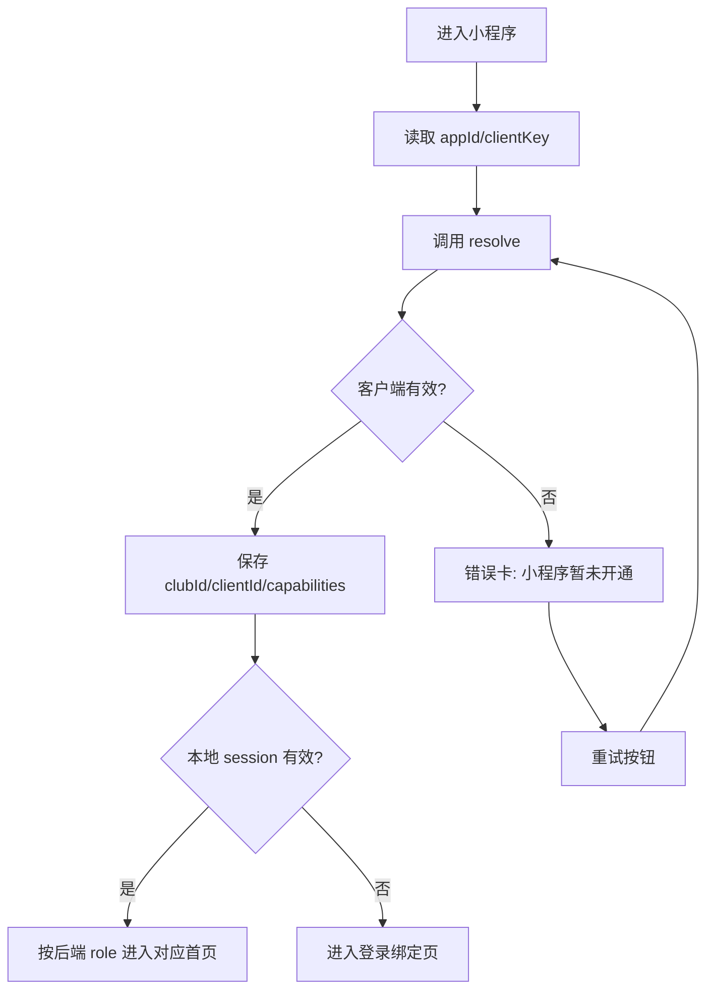

| 卡片 | 交互 |
| --- | --- |
| 品牌状态卡 | 只展示俱乐部客户端名称和启动进度，不显示角色选择。 |
| 错误卡 | 点击“重试”重新 resolve；点击“联系俱乐部”展示客服电话或说明。 |
| 加载卡 | 禁止用户跳过；超过合理时间展示网络失败重试。 |

### 3.2 登录绑定页

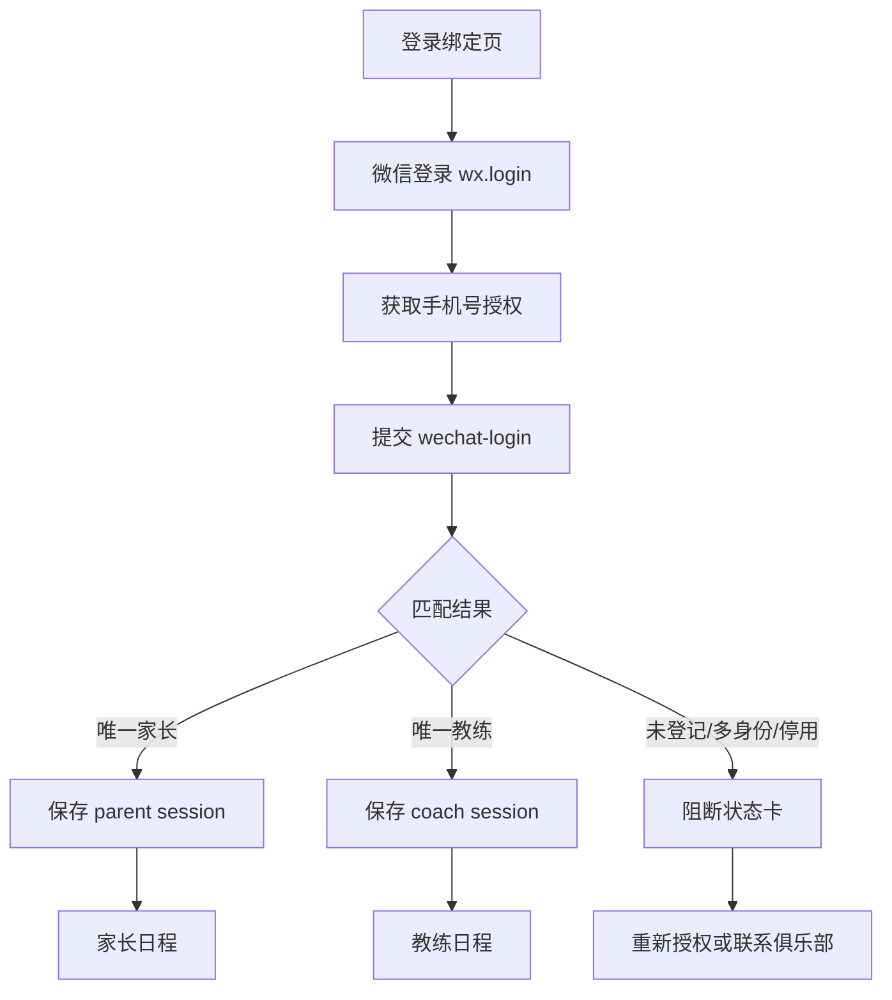

| 卡片 | 交互 |
| --- | --- |
| 手机号授权卡 | 主按钮调用微信手机号授权；未授权时保留本页，不进入业务页。 |
| 身份异常卡 | 展示异常原因：未登记、多身份、无绑定孩子、档案停用；不允许用户自选角色。 |
| 账号说明卡 | 说明身份来自俱乐部资料；不展示后台字段和 WPS 原始信息。 |

## 4. 家长端页面

### 4.1 家长日程首页

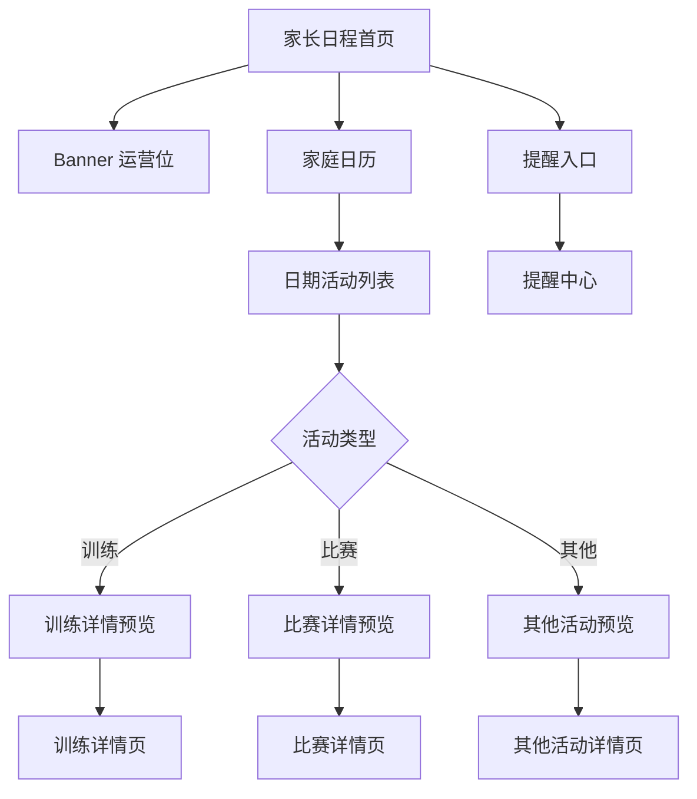

| 卡片 | 交互 |
| --- | --- |
| Banner 卡 | 轮播；点击按 `linkType` 打开图文、活动详情或无动作；无数据时不占位。 |
| 家庭日历卡 | 点击日期刷新下方列表；日期标记训练、比赛、其他、取消/变更；多孩子同日显示数字角标。 |
| 活动摘要卡 | 点击进入对应详情；训练、比赛、其他使用不同状态标签；只展示当前家长绑定孩子信息。 |
| 活动详情预览卡 | 若当天单活动可默认展开；多活动时点击卡片切换预览；不可修改考勤、课时和结果。 |
| 同步状态卡 | 数据延迟时展示最近同步时间；点击刷新。 |

### 4.2 日期活动列表

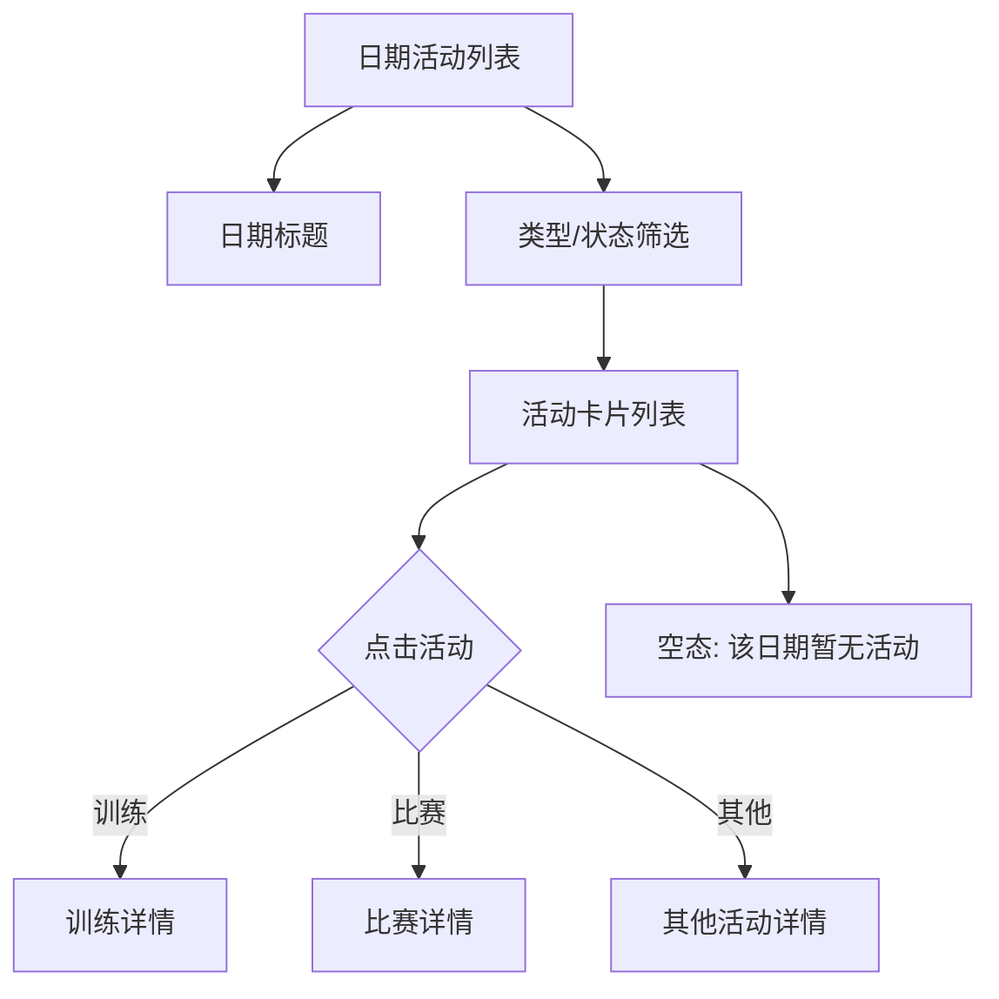

| 卡片 | 交互 |
| --- | --- |
| 筛选条 | 可切换全部、训练、比赛、其他、已取消；筛选不影响权限裁剪。 |
| 活动卡 | 点击进入详情；取消活动仍保留卡片并显示取消原因；场地缺失显示“场地待确认”。 |
| 多孩子标签 | 展示孩子姓名和队伍来源；不展示其他学员资料。 |

### 4.3 训练详情

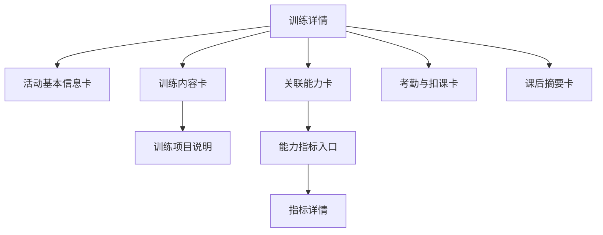

| 卡片 | 交互 |
| --- | --- |
| 基本信息卡 | 展示时间、场地、队伍/课程、教练；场地可打开地图能力，缺失时只显示待确认。 |
| 训练内容卡 | 展示教练选择的训练项目；点击项目展开目标、时长、注意事项；无内容显示“训练内容待教练确认”。 |
| 关联能力卡 | 点击能力进入指标详情或能力说明；家长不看公式和权重。 |
| 考勤与扣课卡 | 只读展示到课、迟到、缺勤、免扣、扣课数量和剩余课时；异常提示线下联系。 |
| 课后摘要卡 | 展示训练观察摘要；未完成训练显示“课后结果待更新”。 |

### 4.4 比赛详情

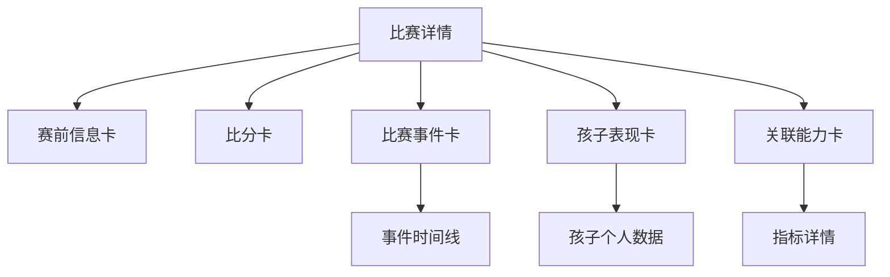

| 卡片 | 交互 |
| --- | --- |
| 赛前信息卡 | 展示比赛类型、对手、时间、场地、集合信息；比赛未开始时作为主内容。 |
| 比分卡 | 赛后展示比分；未录入显示“比赛结果待更新”。 |
| 事件卡 | 展示进球、助攻、关键事件时间线；点击事件展开备注；不进入编辑。 |
| 孩子表现卡 | 展示当前孩子相关进球、助攻、出场、点评；不展示其他孩子成长评估。 |
| 关联能力卡 | 将比赛事件映射为能力来源记录，点击进入指标详情。 |

### 4.5 其他活动详情

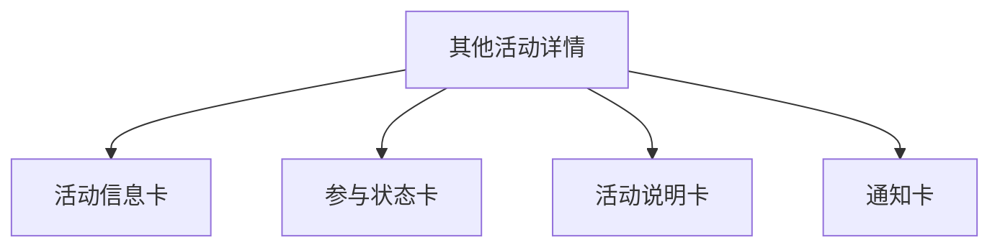

| 卡片 | 交互 |
| --- | --- |
| 活动信息卡 | 展示标题、类型、时间、地点；地点支持导航。 |
| 参与状态卡 | 展示孩子是否参与、是否取消或变更；家长不可修改。 |
| 活动说明卡 | 展开/收起长说明；无说明时隐藏。 |
| 通知卡 | 点击跳转提醒详情或图文内容。 |

### 4.6 提醒中心

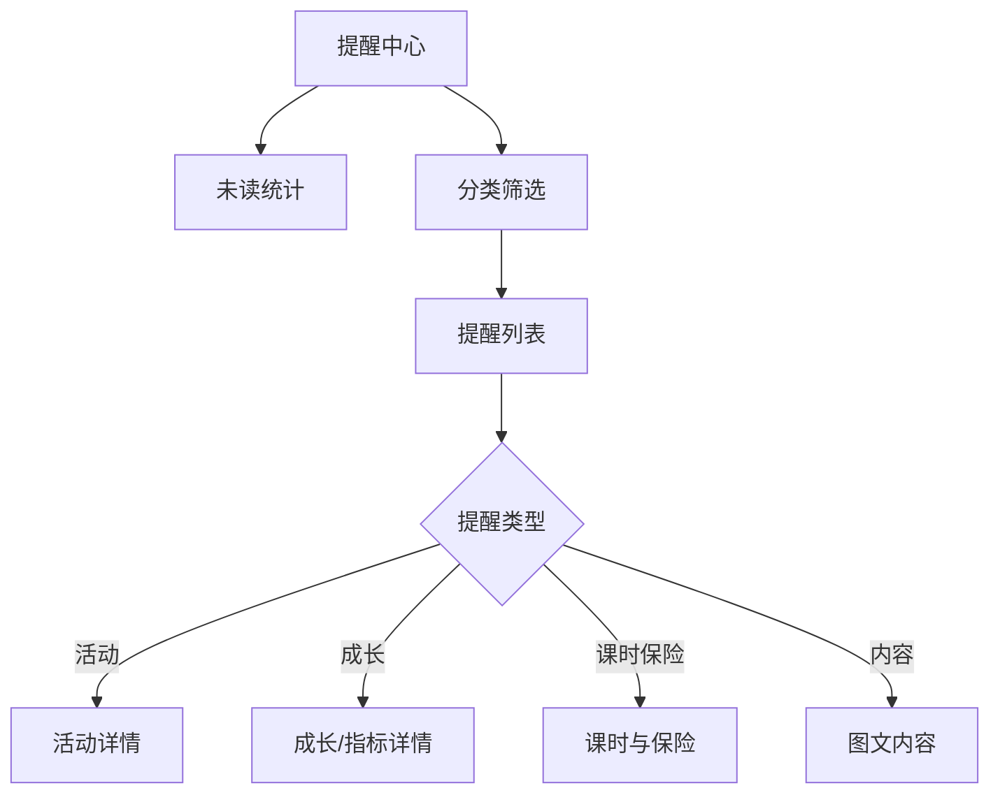

| 卡片 | 交互 |
| --- | --- |
| 未读统计卡 | 点击“一键已读”需二次确认；接口未接时展示待接入。 |
| 提醒卡 | 点击后标记已读并跳转关联对象；若对象已取消/下架，进入说明页。 |
| 分类筛选卡 | 支持全部、活动、成长、课时保险、系统；筛选不丢失未读数。 |

### 4.7 成长首页

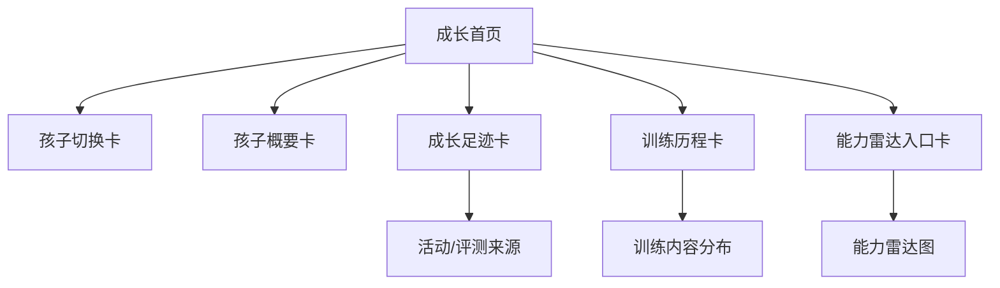

| 卡片 | 交互 |
| --- | --- |
| 孩子切换卡 | 多孩子左右切换；切换后刷新成长、雷达、课时等数据。 |
| 概要卡 | 展示年龄组、队伍、主教练、在训时长；字段不可见时隐藏。 |
| 成长足迹卡 | 点击里程碑进入来源活动或评测；无数据时提示完成训练/比赛/评测后生成。 |
| 训练历程卡 | 展开训练次数、比赛场次、出勤率、训练项目分布；点击项目看相关训练。 |
| 雷达入口卡 | 点击进入雷达；样本不足时展示原因，不画 0 分。 |

### 4.8 能力雷达图

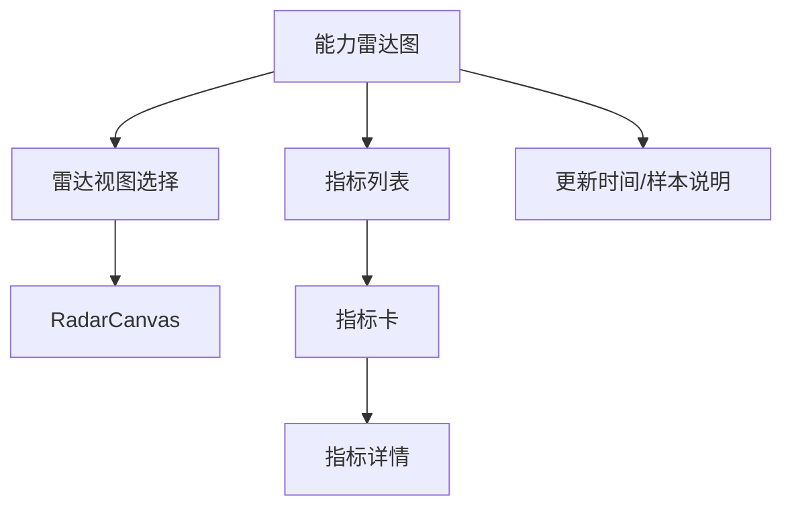

| 卡片 | 交互 |
| --- | --- |
| 雷达视图选择卡 | 切换后台配置的 `MetricView`；没有配置时展示空态。 |
| RadarCanvas 卡 | 首次进入绘制 150-220ms；reduced-motion 时直接显示；点击点位同步高亮指标卡。 |
| 指标卡 | 展示当前值、同龄平均、趋势方向；点击进入指标详情。 |
| 样本说明卡 | 说明数据来源和更新时间；不展示公式、权重和其他孩子数据。 |

### 4.9 指标详情/下钻

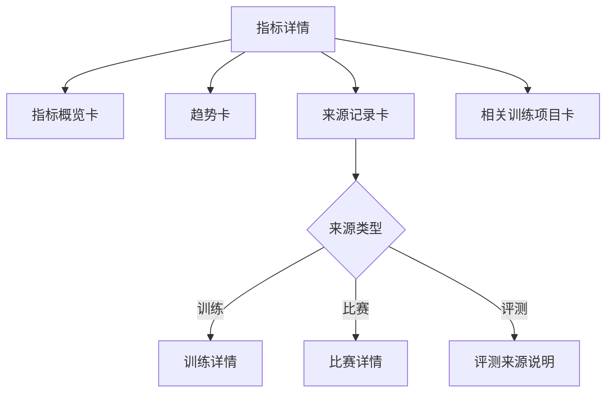

| 卡片 | 交互 |
| --- | --- |
| 指标概览卡 | 展示当前值、单位、同龄平均、更新时间；不可见指标返回 403 状态。 |
| 趋势卡 | 点击趋势点展示来源日期和数值；样本不足显示说明。 |
| 来源记录卡 | 点击跳转活动详情或评测来源；无来源显示“暂无可追溯记录”。 |
| 相关训练项目卡 | 展示推荐训练项目来源于后端训练目录；点击只展开说明，不生成课程。 |

### 4.10 我的孩子首页/孩子档案

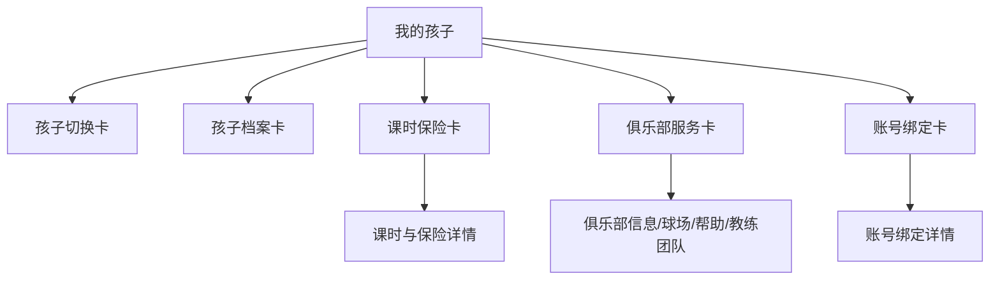

| 卡片 | 交互 |
| --- | --- |
| 孩子档案卡 | 展示姓名、年龄、队伍、主教练、入训时间；学校等字段按隐私策略显示。 |
| 课时保险卡 | 点击进入详情；低课时、保险过期、待同步用独立状态标签。 |
| 俱乐部服务卡 | 分入口进入俱乐部信息、球场分布、青训帮助、教练团队、私教意向。 |
| 账号绑定卡 | 点击查看绑定状态；不允许切换身份或绑定其他档案。 |

### 4.11 课时与保险

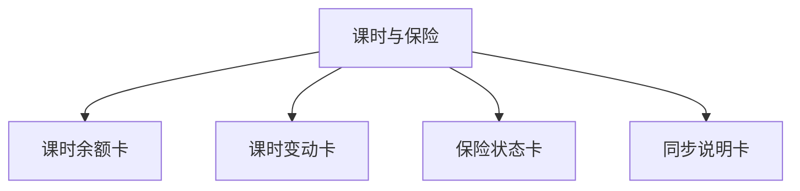

| 卡片 | 交互 |
| --- | --- |
| 课时余额卡 | 展示剩余课时和状态；0 课时必须显示真实 0，不隐藏。 |
| 课时变动卡 | 展开最近扣课/返还记录；点击关联活动进入详情。 |
| 保险状态卡 | 展示有效、过期、待确认、未同步；保单信息仅脱敏展示。 |
| 同步说明卡 | 展示最近同步时间和线下确认说明；无在线支付、投保、申诉入口。 |

### 4.12 俱乐部信息、球场、帮助、教练团队

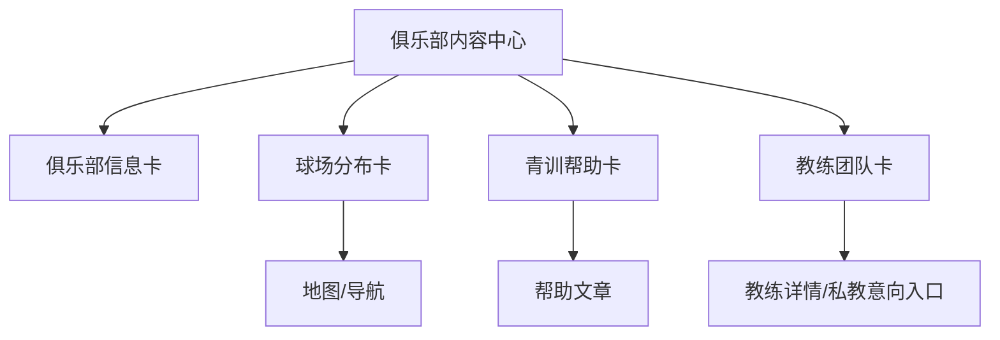

| 卡片 | 交互 |
| --- | --- |
| 俱乐部信息卡 | 电话可拨打；地址可导航；未维护字段隐藏。 |
| 球场卡 | 点击打开地图或球场详情；展示停车、集合点、适用队伍。 |
| 帮助文章卡 | 点击打开图文；内容下架时展示已失效。 |
| 教练卡 | 点击进入教练简介；私教意向入口按 capabilities 显示。 |

### 4.13 私教意向

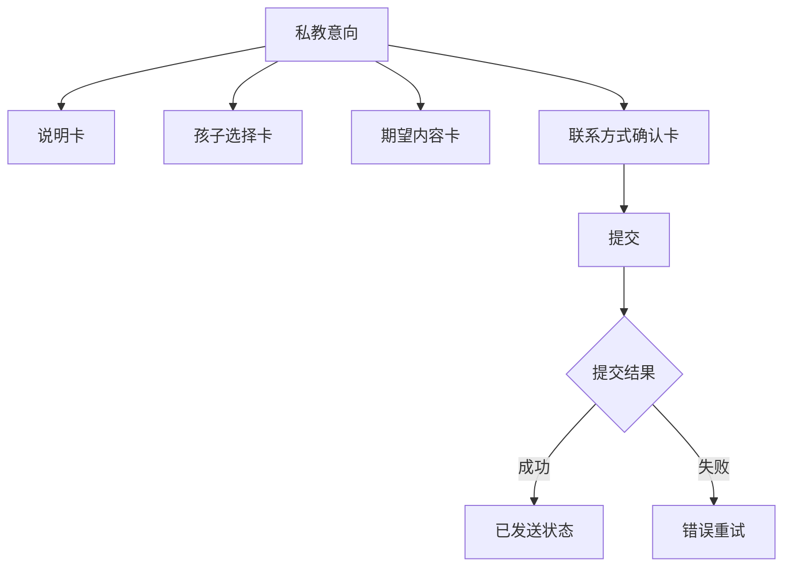

| 卡片 | 交互 |
| --- | --- |
| 说明卡 | 明确不是预约、订单、支付或自动派单。 |
| 孩子选择卡 | 默认当前孩子；无孩子不可提交。 |
| 期望内容卡 | 选择训练方向并填写备注；重复提交时展示已提交状态。 |
| 联系方式确认卡 | 展示脱敏联系方式；不允许在小程序直接改后台档案。 |
| 提交栏 | 提交意向通知；成功后禁用重复提交或展示再次补充入口。 |

### 4.14 账号绑定

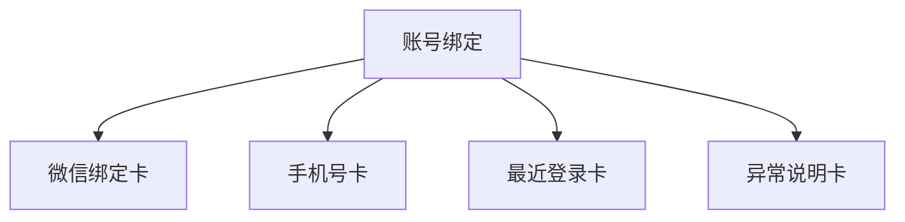

| 卡片 | 交互 |
| --- | --- |
| 微信绑定卡 | 展示已绑定、绑定时间；绑定失效时引导重新登录。 |
| 手机号卡 | 只展示脱敏手机号；不提供自行修改。 |
| 最近登录卡 | 展示最近登录时间和客户端；异常可联系客服。 |
| 异常说明卡 | 按未登记、多身份、停用、无孩子绑定展示处理方式。 |

## 5. 教练端页面

### 5.1 教练日程首页

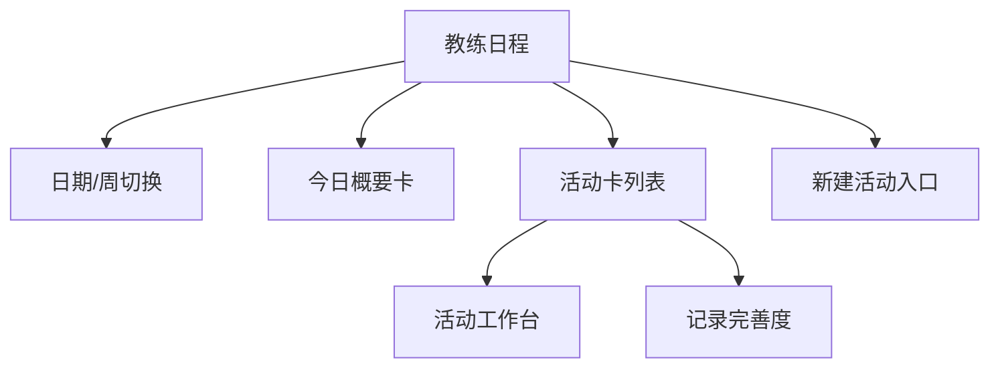

| 卡片 | 交互 |
| --- | --- |
| 日期切换卡 | 切换日/周；刷新负责活动；无权限时展示说明。 |
| 今日概要卡 | 点击待办数字筛选待点名、待销课、待录比赛、待评测。 |
| 活动卡 | 点击进入工作台；更多菜单按权限显示编辑、取消、恢复、复制。 |
| 记录完善度卡 | 展示点名、销课、训练内容、比赛、测试完成度；点击进入对应补录页。 |
| 新建入口卡 | 未接入写接口时显示“暂需后台处理”；有权限才展示。 |

### 5.2 活动详情教练版/活动工作台

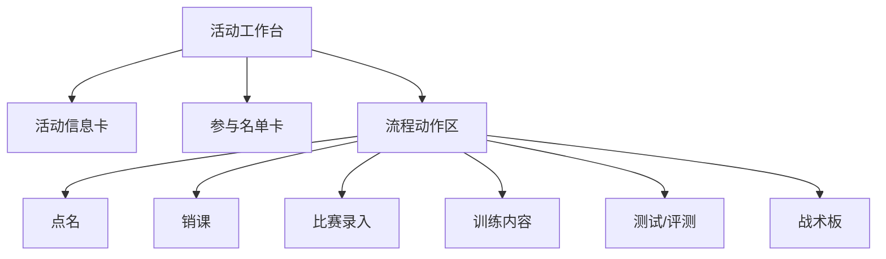

| 卡片 | 交互 |
| --- | --- |
| 活动信息卡 | 展示状态、时间、场地、队伍、人数；取消活动禁用写操作。 |
| 参与名单卡 | 点击学员进入学员能力或本活动状态；名单为空提示后台补充。 |
| 流程动作卡 | 按 workflow/capabilities 展示主操作；已完成动作显示结果和纠正入口。 |
| 待完善卡 | 点击进入缺失项；非阻塞项不能卡住点名和销课。 |

### 5.3 新建/编辑/取消/恢复活动

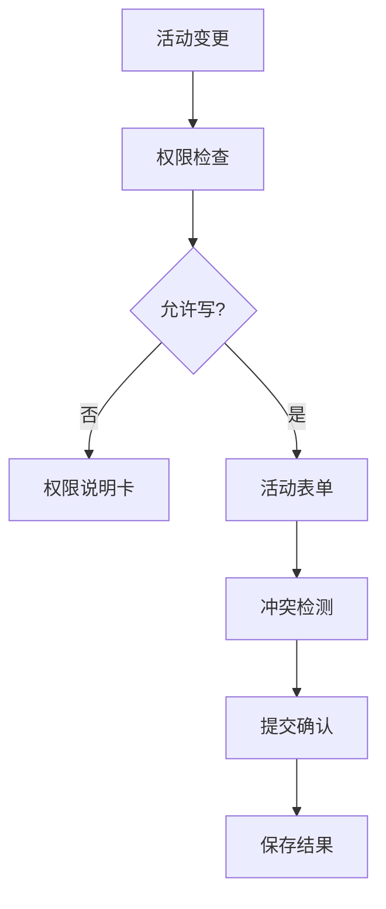

| 卡片 | 交互 |
| --- | --- |
| 权限说明卡 | 无权限或接口未接入时展示后台处理说明。 |
| 活动表单卡 | 活动类型、队伍、时间、场地、备注；重复规则用后端 RRULE 能力。 |
| 冲突卡 | 展示教练/学员/场地冲突；不允许忽略高风险冲突。 |
| 取消/恢复卡 | 二次确认；取消触发家长日程更新和提醒。 |

### 5.4 点名

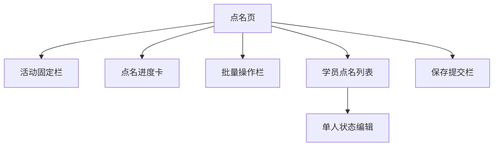

| 卡片 | 交互 |
| --- | --- |
| 活动固定栏 | 保持时间、队伍、状态可见；取消或无权限时禁用保存。 |
| 进度卡 | 展示已处理/总人数；点击筛选未处理。 |
| 批量操作卡 | 一键全员到课；二次确认覆盖未处理项，不覆盖已手动备注项。 |
| 学员卡 | 点击切换到课、迟到、缺席、请假、免扣；可添加备注。 |
| 保存栏 | 带 `Idempotency-Key` 提交；失败保留本地草稿并支持重试。 |

### 5.5 销课确认/纠正

```mermaid
flowchart TD
  A["销课页"] --> B["销课规则卡"]
  A --> C["默认全员销课草稿"]
  C --> D["例外学员列表"]
  A --> E["剩余课时预览"]
  A --> F["确认/纠正提交"]
```

| 卡片 | 交互 |
| --- | --- |
| 规则卡 | 展示活动结束后可确认、15 天纠正期限和当前状态。 |
| 学员销课卡 | 默认销课；点击切换不销课/返还/补扣；必须填写例外原因。 |
| 余额预览卡 | 展示扣减后剩余课时；未知余额不阻止保存，但标记待同步。 |
| 提交栏 | 首次确认用 POST，纠正用 PATCH；超期禁用并提示后台处理。 |

### 5.6 比赛录入

```mermaid
flowchart TD
  A["比赛录入"] --> B["比赛信息卡"]
  A --> C["比分卡"]
  A --> D["名单卡"]
  A --> E["事件列表"]
  E --> F["添加进球/助攻/事件"]
  A --> G["球员点评卡"]
  A --> H["提交栏"]
```

| 卡片 | 交互 |
| --- | --- |
| 比赛信息卡 | 展示对手、类型、场地；未建比赛上下文时提示回活动工作台。 |
| 比分卡 | 输入主客队比分；未完赛可保存草稿。 |
| 名单卡 | 选择出场学员；无名单时阻断提交。 |
| 事件卡 | 添加进球、助攻、关键事件；事件类型来自 capabilities。 |
| 点评卡 | 可选非阻塞；未填不影响基础比赛结果提交。 |
| 提交栏 | 提交后生成对应 `PlayerMetricRecord`；失败保留草稿。 |

### 5.7 战术板入口

```mermaid
flowchart TD
  A["战术板入口"] --> B["PoC 状态卡"]
  A --> C["阵型模板卡"]
  A --> D["进入按钮"]
  D --> E{"PoC/接口可用?"}
  E -- "否" --> F["待接入说明"]
  E -- "是" --> G["战术板画布"]
```

| 卡片 | 交互 |
| --- | --- |
| PoC 状态卡 | 明确当前是否可用；不可用不阻塞比赛录入。 |
| 阵型模板卡 | 可用时选择阵型；未配置显示空态。 |
| 进入按钮 | 家长端不可见；教练无比赛权限时禁用。 |

### 5.8 训练管理首页/我的球队

```mermaid
flowchart TD
  A["训练管理"] --> B["负责球队卡"]
  A --> C["待完善卡"]
  A --> D["测试任务卡"]
  A --> E["训练内容入口"]
  A --> F["能力概览入口"]
```

| 卡片 | 交互 |
| --- | --- |
| 负责球队卡 | 点击进入球队详情；只显示负责或授权球队。 |
| 待完善卡 | 点击筛选待补训练内容、待评测、待比赛数据。 |
| 测试任务卡 | 点击进入测试任务列表；无任务显示空态。 |
| 训练内容卡 | 点击进入训练项目树；项目库未配置时展示待同步。 |
| 能力概览卡 | 点击进入学员雷达或全队概览；样本不足显示说明。 |

### 5.9 球队详情

```mermaid
flowchart TD
  A["球队详情"] --> B["队伍信息卡"]
  A --> C["学员列表卡"]
  A --> D["近期活动卡"]
  A --> E["能力概览卡"]
  A --> F["待办卡"]
```

| 卡片 | 交互 |
| --- | --- |
| 队伍信息卡 | 展示年龄段、人数、主教练、训练安排；无编辑入口。 |
| 学员卡 | 点击进入学员雷达；显示出勤/评测状态，不显示隐私字段。 |
| 近期活动卡 | 点击进入活动工作台；取消活动保留状态。 |
| 能力概览卡 | 展示全队分布和弱项；不在前端计算公式。 |
| 待办卡 | 跳转对应补录页；不阻塞查看。 |

### 5.10 训练内容选择与能力覆盖预览

```mermaid
flowchart TD
  A["训练内容选择"] --> B["能力树卡"]
  B --> C["训练项目列表"]
  C --> D["已选项目篮"]
  D --> E["能力覆盖预览"]
  E --> F["保存到活动"]
  E --> G["应用到未来课程"]
```

| 卡片 | 交互 |
| --- | --- |
| 能力树卡 | 展开核心能力、子能力、项目；层级来自后端，不固定三层。 |
| 项目卡 | 点击加入/移除；展示建议时长、关联指标、适用年龄段。 |
| 已选项目卡 | 可调整顺序和时长；重复项目合并或提示。 |
| 覆盖预览卡 | 后端返回覆盖结果；点击能力可看相关项目，不做 AI 推荐。 |
| 保存栏 | 保存当前活动训练内容；应用未来课程必须二次确认范围。 |

### 5.11 测试任务与按项目录入测试成绩

```mermaid
flowchart TD
  A["测试任务"] --> B["任务列表"]
  B --> C["测试项目录入页"]
  C --> D["项目说明卡"]
  C --> E["学员成绩表"]
  E --> F["单格输入/缺测"]
  C --> G["自动保存状态"]
```

| 卡片 | 交互 |
| --- | --- |
| 任务卡 | 点击进入任务；显示模板、队伍、完成度、截止时间。 |
| 项目说明卡 | 展示测试项目、单位、录入规则、异常值范围。 |
| 成绩单元格 | 输入原始值；支持缺测原因；弱网时保留本地草稿。 |
| 保存状态卡 | 单格自动保存成功/失败/重试；当前接口缺失时展示手动完整提交模式。 |

### 5.12 学员雷达图与全队能力概览

```mermaid
flowchart TD
  A["能力概览"] --> B["学员选择卡"]
  A --> C["RadarCanvas"]
  A --> D["指标列表"]
  A --> E["全队分布卡"]
  D --> F["指标下钻"]
```

| 卡片 | 交互 |
| --- | --- |
| 学员选择卡 | 切换授权学员；不展示未授权队伍学生。 |
| 雷达卡 | 展示学员当前值、同龄平均或队伍摘要；样本不足不画 0。 |
| 指标卡 | 点击看来源记录和训练建议；教练可见范围按 permission context。 |
| 全队分布卡 | 展示区间分布和待完善数量；不向家长端开放。 |

### 5.13 评测录入

```mermaid
flowchart TD
  A["评测录入"] --> B["模板选择卡"]
  A --> C["学员选择卡"]
  A --> D["原子项输入表"]
  D --> E["自动计算项只读"]
  A --> F["保存草稿/提交"]
  F --> G["后端计算与 lineage"]
```

| 卡片 | 交互 |
| --- | --- |
| 模板卡 | 选择评测模板版本；无模板显示待配置。 |
| 学员卡 | 支持单人或队伍批量入口；仅授权学员可选。 |
| 输入项卡 | 只录原子输入项；单位、范围、必填来自后端表单配置。 |
| 计算项卡 | 只读展示或提交后展示；前端不执行公式。 |
| 提交栏 | 校验必填、异常值和幂等；提交后写入评测、指标记录和 lineage。 |

### 5.14 教练我的

```mermaid
flowchart TD
  A["教练我的"] --> B["教练身份卡"]
  A --> C["负责球队卡"]
  A --> D["权限范围卡"]
  A --> E["私教意向提醒"]
  A --> F["操作帮助"]
  A --> G["账号绑定/俱乐部联系方式"]
```

| 卡片 | 交互 |
| --- | --- |
| 教练身份卡 | 展示头像、姓名、职务、状态；档案停用时阻断业务入口。 |
| 负责球队卡 | 点击进入球队详情；无球队显示权限说明。 |
| 权限范围卡 | 展示可看、可写、可纠正范围；点击展开解释。 |
| 私教意向卡 | 点击查看家长意向通知；只读，不派单、不生成订单。 |
| 操作帮助卡 | 打开帮助图文；内容未维护时隐藏。 |
| 账号绑定卡 | 展示绑定状态和最近登录；不允许切换身份。 |

## 6. 开发缺口判定

实现页面时，若当前代码缺少上文任一页面、卡片或跳转，按以下规则处理：

1. BFF 已存在：直接接入真实数据。
2. BFF 缺失但产品确认：保留页面结构，展示 `pending` 状态，并更新 `docs/miniprogram-bff-gap-cq-talent.md`。
3. 后端能力不应由前端计算：例如评测公式、能力覆盖、权限裁剪、课时状态、保险状态，必须等待 BFF。
4. 详情页缺失时不得用 toast 或列表内展开替代，必须建立独立页面或明确记录为 MVP 缺口。
5. 所有写操作必须具备 loading、success、error、draft/retain 和 `Idempotency-Key`。
