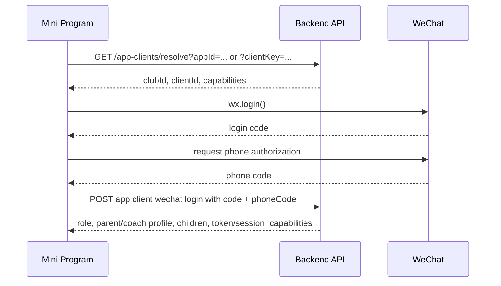

# 重庆天才小程序产品设计规格

## 当前状态

本文档是重庆天才小程序家长端与教练端的阶段性完整产品规格。它记录已经通过产品讨论确认的信息架构、页面规则、登录身份、提醒策略、权限边界、BFF/API 需求，以及进入技术架构和开发计划前需要保留的产品边界。

## 范围与原则

首个小程序客户端服务重庆天才足球俱乐部。固定种子身份仅用于首个客户端配置与验收：

- `clubId`: `club-chongqing-talent`
- `clubCode`: `cq-talent`
- `clubName`: `重庆天才足球俱乐部`

小程序不得写死重庆天才的业务字段、课时规则、评测项、训练项目、比赛事件类型或家长可见范围。运行时必须通过 `appId` 或 `clientKey` 解析出 `clubId`、`clientId` 和 `capabilities`，再消费俱乐部作用域业务 API。

本规格只覆盖小程序产品设计、信息架构、页面流程和接口消费说明。不写小程序代码，不新增后端模型。WPS/Excel、字段映射、同步策略、线下收费确认、保险确认等仍属于后台和集成能力；小程序只消费后端整理后的业务事实。

进入开发前必须同时遵守 [小程序技术选型与开发工作流](./miniprogram-development-workflow.md)。涉及雷达图、战术板、测试录入、自动保存、消息提醒或第三方依赖时，必须先完成该工作流中的选型记录、PoC 验收和依赖登记。

## 身份与登录

### 核心规则

- 小程序不提供用户注册。
- 一个手机号在一个俱乐部小程序内只能对应一个身份：要么家长，要么教练。
- 用户不能在小程序内自选“我是家长/我是教练”。
- 用户身份以俱乐部后台或 WPS 表格同步资料为准。
- 手机号首次用于匹配身份；微信身份用于后续稳定登录。
- 如果手机号未登记、没有绑定孩子、或匹配到多个身份，用户不能进入业务功能，提示联系俱乐部管理员。

### 首次登录流程



首次进入时，后端用微信手机号在当前 `clubId/clientId` 下匹配家长档案或教练档案。查到唯一家长时进入家长端；查到唯一教练时进入教练端。

### 后续登录流程

首次匹配成功后，平台建立微信身份与俱乐部档案的绑定关系：

```text
clubId + clientId + wechatOpenId/unionId -> parentProfile 或 coachProfile
```

后续打开小程序时优先使用微信绑定关系登录，不再依赖当前微信绑定手机号。这样用户更换微信账号绑定手机号但微信账号不变时，不影响继续使用小程序。

绑定对象必须是俱乐部里的家长档案或教练档案，不是手机号本身。

### 微信绑定同步回 WPS

平台内部绑定关系用于登录鉴权。WPS 可以作为俱乐部管理可见状态，接收后端同步或回写：

- 微信绑定状态：已绑定/未绑定
- 绑定时间
- 小程序客户端
- 脱敏 openId/unionId
- 最近登录时间

小程序不直接写 WPS。后端建立绑定后，通过现有 WPS 同步/回写机制让俱乐部管理员在表格中看到绑定状态。

### 登录异常状态

| 状态 | 含义 | 用户处理 |
| --- | --- | --- |
| 小程序客户端未配置 | 当前 `appId/clientKey` 未登记为平台客户端 | 显示“当前小程序暂未开通俱乐部服务，请联系俱乐部管理员”。 |
| 未授权手机号 | 首次登录时后端无法获得手机号，不能匹配身份 | 提示“需要授权手机号后才能确认您的俱乐部身份”，提供重新授权入口。 |
| 手机号未登记 | 手机号不在俱乐部家长/教练资料中 | 提示“该手机号尚未登记为教练或家长，请联系俱乐部管理员”。 |
| 手机号匹配多个身份 | 同一手机号同时匹配多个家长/教练或同时为家长与教练 | 视为后台数据异常，不让用户选择，提示联系俱乐部管理员。 |
| 家长无绑定孩子 | 家长档案存在，但未关联任何孩子 | 不进入业务数据页，提示联系俱乐部管理员补充孩子绑定。 |
| 档案停用 | 家长/教练档案在俱乐部资料中已停用 | 绑定失效或进入待确认状态，提示联系俱乐部。 |

## 家长端信息架构

家长端底部 TabBar 定为 3 个入口：

1. **日程**
   - 俱乐部 Banner
   - 家庭日程日历
   - 选中日期活动列表
   - 选中活动详情
   - 右上角提醒铃铛

2. **成长**
   - 孩子切换
   - 成长足迹
   - 训练历程
   - 能力雷达图和指标下钻

3. **我的孩子**
   - 孩子基础资料
   - 课时与保险
   - 俱乐部信息
   - 青训帮助
   - 账号与绑定状态

家长端整体是只读产品。家长不能在线注册、请假、申诉、修改考勤、修改课时、修改保险、填写评测或提交训练/比赛记录。如有疑问，线下联系俱乐部；俱乐部核实后在后台或 WPS 中修正，小程序同步展示最新结果。

## 日程 Tab

### 页面定位

日程 Tab 是家长端默认首页。它不是孩子档案页，而是家庭日程视图：

> 家长通过日程查看所有孩子的训练、比赛、活动安排；点击日期和活动后，在下方查看课前/赛前信息、课后/赛后结果、考勤和课时结果。

### 页面结构

```text
日程
- 顶部俱乐部 Banner 轮播
- 家庭日程日历
- 选中日期活动列表
- 选中活动详情
- 提醒铃铛入口
```

### Banner

Banner 是俱乐部运营位，由俱乐部维护，不写死在小程序中。

用途：

- 俱乐部宣传图
- 赛事活动宣传
- 招生体验课
- 训练营/冬夏令营
- 重要通知
- 俱乐部荣誉展示
- 可跳转图文页面

Banner 无数据时不占位，日程上移。Banner 不应过高，避免家长打开后看不到日程主体。

建议数据字段：

- `bannerId`
- `title`
- `imageUrl`
- `linkType`: `none`、`article`、`external_page`、`activity`
- `linkTarget`
- `startAt`
- `endAt`
- `sortOrder`
- `enabled`
- `visibleRoles`

### 家庭日程日历

默认展示该家长名下所有孩子的活动，不要求先选孩子。

日历标记规则：

- 训练：训练标记
- 比赛：比赛标记
- 其他活动：通用活动标记
- 活动异常：取消、变更、考勤异常等状态标记
- 同一天多个孩子/多个活动：叠加标记或数字角标

点击日期后，下方展示当天活动列表。若当天只有一个活动，可直接展示该活动详情；若有多个活动，先展示列表，点击后展示详情。

### 活动列表

每条活动需要展示：

- 孩子姓名
- 活动类型：训练、比赛、其他
- 开始/结束时间
- 场地
- 队伍/课程来源
- 状态：未开始、已完成、取消、已到课、缺勤、迟到等
- 是否有课后/赛后结果

一个孩子可以属于多个精英队或专项班。日程活动必须保留来源队伍/课程，便于家长理解该记录来自哪一类训练。

### 训练课详情

未来训练课展示计划信息：

- 孩子
- 时间
- 场地
- 队伍/课程来源
- 教练
- 本次训练内容
- 本次训练相关能力

已完成训练课展示结果信息：

- 实际考勤状态
- 本次是否扣课时
- 扣课时数量
- 课后剩余课时
- 本次训练内容
- 本次训练相关能力参考

家长端不展示请假按钮，不提供考勤申诉入口。

### 训练内容展示

每堂训练课的训练内容由教练端从训练项目库拖选组成。家长端只读展示教练已选择的训练项目。

训练内容可以 1-2 周保持相同，这表示一个训练周期的重点，不要求每节课都不同。

家长端展示示例：

```text
本次训练内容
- 传接球基础
- 变向带球
- 3v3 小场对抗
- 射门练习
```

每个训练项目需要关联能力指标。日程详情中展示轻量能力说明：

```text
本次训练相关能力
控球｜传接球｜对抗决策｜射门
```

日程中的能力说明只帮助家长理解“这堂课练了什么、和哪些能力有关”，不做复杂雷达图和完整成长分析。

### 日程中的能力参考

日程详情可以展示本堂训练关联能力的简单数值参考：

```text
传接球
孩子当前：68
同龄平均：72

控球
孩子当前：75
同龄平均：70
```

规则：

- 只展示数值参考，不展示排名。
- 不展示其他孩子个人数据。
- 不做自动归因，不说“本节课提升了多少”。
- 如果无孩子当前值，显示“暂无数据”。
- 如果样本不足，不显示同龄平均。
- 完整雷达图和能力模型下钻放到成长 Tab。

### 比赛详情

赛前信息：

- 孩子
- 比赛时间
- 比赛地点
- 比赛类型：杯赛、联赛、友谊赛等
- 对手
- 队伍/参赛来源
- 集合时间/集合地点，如后端有
- 赛前说明

赛后信息：

- 比分
- 进球人员
- 助攻或关键事件，如有记录
- 比赛过程事件
- 出场时间、位置、统计数据，如有记录
- 关联能力数据入口

比赛数据按通常做法整体可见。家长可以看到比赛整体信息、比分、过程事件和统计数据；成长模型中仍只展示自己孩子的能力画像，不展示其他孩子个人成长评估。

### 过去日期

过去日期展示实际结果：

- 实际考勤状态
- 课时扣减结果
- 剩余课时变化
- 比赛结果
- 训练内容
- 关联成长数据入口

如果家长认为结果有误，统一线下联系俱乐部。俱乐部核实后在后台或 WPS 修正，小程序同步新结果。首版不显示纠正历史。

### 日程提醒入口

日程页放一个类似铃铛的提醒入口，显示红色未读数字。

提醒中心展示：

- 训练/比赛前提醒
- 活动时间、地点、内容变更
- 活动取消
- 新训练课后结果
- 新比赛结果
- 新评测或成长数据更新
- 课时/保险状态提醒
- 俱乐部公告

提醒项点击后跳转到对应活动、成长记录、我的孩子状态或图文内容。

### 公众号提醒策略

俱乐部可以通过公众号发送日程提醒：

- 默认活动前一天发送提醒。
- 活动变更随时发送。
- 关注公众号后，只要能匹配到家长身份，就按规则发送。
- 多个孩子的提醒不合并，各发各的。

示例：

```text
明天 18:30 周子航训练｜奥体中心 3号场
```

```text
周六 09:00 周子航联赛｜集合 08:20 奥体中心北门
```

落地前需按微信官方能力确认小程序订阅消息、公众号模板消息/订阅通知、unionId/手机号匹配等限制。产品层统一抽象为“日程提醒通道”。

## 成长 Tab

### 页面定位

成长 Tab 看个体成长，不是家庭总览。顶部必须先切换孩子。如果家长只有一个孩子，则直接展示该孩子。

成长 Tab 的目标是把三类信息穿起来：

```text
成长足迹 -> 训练历程 -> 能力画像
```

它既要提供情绪价值，也要让家长理解孩子长期训练过程和能力强弱。

### 顶部孩子信息

顶部展示：

- 孩子姓名
- 当前年龄组
- 在训时长
- 所属队伍/课程列表
- 主教练列表

一个孩子可能同时或先后在多个精英队、专项班受训。顶部必须展示完整归属，不能只展示一个队。

展示示例：

```text
周子航
U8精英队｜周末提高班｜守门员专项班
在训 2年3个月｜主教练：刘启航、李远航
```

队伍很多时可显示“U8 精英队等 3 个队伍”，点击展开完整列表：

- 队伍名称
- 类型/年龄组
- 主教练
- 在队时间
- 当前状态：在训/已结束

成长统计默认跨队汇总，口径是该孩子在本俱乐部内的全部训练、比赛、评测数据。下钻记录保留来源队伍、教练和活动。

### 成长足迹

成长足迹用于提供情绪价值，建议使用横向滑动时间轴或类似鱼骨图的结构。

内容包括：

- 加入俱乐部
- 升入某个队伍
- 第一次正式比赛
- 参加重要杯赛/联赛
- 获得个人奖项
- 队伍荣誉
- 阶段评测完成
- 训练满 50 节、100 节
- 代表队出场、进球、助攻等里程碑

节点点击后进入对应详情：

- 比赛节点 -> 比赛详情
- 奖项节点 -> 奖项详情
- 评测节点 -> 评测报告
- 训练里程碑 -> 训练统计

这一层不展示训练流水账，只展示重要成长节点。

### 训练历程

训练历程回答：

- 孩子总共训练了多少？
- 最近训练频率如何？
- 主要练了哪些内容？
- 哪些能力相关训练最多？
- 某种能力最近进行了哪些训练？

建议展示：

1. 训练总览
   - 累计训练次数
   - 近 30 天训练次数
   - 累计比赛场次
   - 出勤率

2. 训练内容分布
   - 传接球、控球、对抗、射门、体能等训练项目出现次数。
   - 可用横向条形图或统计列表。

3. 按能力看训练覆盖
   - 传接球能力：近 30 天训练次数
   - 控球能力：近 30 天训练次数
   - 对抗决策：近 30 天训练次数

下钻：

- 点某个训练项目 -> 查看最近哪些课练了该项目。
- 点某个能力 -> 查看围绕该能力安排过哪些训练项目。
- 点某一堂课 -> 回到日程中的训练课详情。

### 能力雷达图

雷达图放在成长 Tab 中单独展示，不放在日程详情中。

雷达图由俱乐部后台配置的展示视图决定，不由小程序预设一级/二级结构。表格中“第一季展示的内容”和后台立体图谱共同决定家长端可选的雷达图。

交互规则：

- 顶部下拉选择不同雷达图。
- 雷达图展示孩子当前值和同龄平均。
- 指标如果是建模指标，点击后进入它对应的下钻雷达图或指标结构。
- 指标如果是原子指标，点击后进入指标详情。

指标详情展示：

- 当前值
- 同龄平均，如样本足够
- 最近趋势
- 来源记录：评测、训练观察、比赛事件
- 相关训练项目
- 最近相关课程

### 同龄平均

能力对比统一使用同龄平均，不使用队伍均值。

规则：

- 按 `U8/U9` 等年龄组计算。
- 数值用俱乐部库内同年龄组数据拉通计算平均。
- 使用每个孩子同一指标的最新有效值。
- 样本不足时不显示平均值。
- 不展示排名。
- 不展示其他孩子个人数据。
- 不跨评测模型混算。
- 指标口径不一致时不能强行平均。

页面显示用“同龄平均”。说明文案可写：

```text
同龄平均基于俱乐部内同年龄组学员最近一次有效记录计算。
```

### 成长建议

首版不做 AI 评价，不做自动计算能力提升。

如果需要轻量提示，只能使用确定性数据规则，例如：

```text
传接球低于同龄平均，最近 2 周已有 3 次相关训练。
```

不说“训练后一定提升”，不做未经确认的主观判断。

## 我的孩子 Tab

### 页面定位

“我的孩子”是家庭服务中心。它展示孩子档案、课时保险、俱乐部信息和青训帮助内容。所有资料以俱乐部后台/WPS 同步为准，家长只读，有问题线下联系俱乐部处理。

页面结构：

```text
我的孩子
- 孩子切换/孩子列表
- 孩子档案
- 课时与保险
- 俱乐部信息
- 青训帮助
- 账号与绑定
```

### 孩子档案

建议展示：

- 姓名
- 性别
- 出生日期/年龄
- 所属队伍/课程
- 主教练
- 入俱乐部时间
- 当前训练状态
- 学校/区域，如俱乐部允许展示

不建议展示：

- 身份证号
- 家庭住址
- 内部渠道来源
- 收费备注
- 后台运营备注
- WPS 原始字段

资料有误时提示：

```text
如资料有误，请联系俱乐部工作人员修改。
```

### 课时与保险

课时展示：

- 剩余课时
- 最近一次扣课时间
- 最近一次扣课活动
- 最近几条课时变动摘要
- 状态：正常/低课时/待同步

保险展示：

- 保险状态：有效/已过期/待确认/未同步
- 到期日
- 审核状态
- 保单号是否展示由俱乐部配置控制
- 健康/安全提示入口

边界：

- 家长只读。
- 不做在线充值。
- 不做在线投保。
- 不做退款、发票、结算。
- 不做线上申诉。

### 俱乐部信息

俱乐部基础信息由俱乐部维护：

- 俱乐部名称
- Logo
- 简介
- 联系电话
- 微信/公众号
- 地址
- 服务时间
- 管理员/客服联系方式
- 训练理念/青训体系简介
- 荣誉与赛事介绍入口

这些信息服务家长找人、理解俱乐部，也服务俱乐部宣传。

### 青训帮助

青训帮助内容由俱乐部维护，平台后续可以沉淀通用内容模板。

建议分类：

- 球场与交通
- 观赛指南
- 健康保护
- 训练装备
- 课时保险说明
- 常见问题

内容示例：

- 球场分布
- 常用球场导航
- 停车/入口说明
- 场地集合点
- 俱乐部观赛指南
- 赛事报名说明
- 训练装备要求
- 雨天/高温训练规则
- 儿童运动损伤预防
- 训练前后拉伸
- 饮食补水建议
- 如何理解孩子阶段性评测
- 如何支持孩子面对输赢

### 球场分布

球场分布是重要的本地青训内容，建议作为可配置内容而非静态页面。

建议字段：

- `venueId`
- `name`
- `address`
- `geoLocation`
- `navigationUrl`
- `fieldType`
- `parkingInfo`
- `entranceGuide`
- `meetingPoint`
- `photos`
- `notes`
- `maintainedByClubId`
- `visibility`

小程序展示：

- 球场列表
- 导航入口
- 停车说明
- 集合点照片
- 适用训练队伍/活动
- 最近相关日程


### 教练团队与私教意向

家长端“我的孩子 -> 俱乐部信息”增加教练团队展示。该功能用于俱乐部宣传和家长了解教练，不是在线约课系统。

教练展示内容由俱乐部维护：

- 教练头像
- 姓名
- 专长
- 任教年限
- 资质证书
- 简介
- 负责方向
- 是否开放私教意向

教练详情页可提供“有私教意向”入口。家长提交的是意向通知，不是预约、订单或自动排课。

私教意向表单尽量简单：

- 选择孩子
- 意向方向，可选
- 备注，可选
- 联系方式确认

提交后提示：

```text
私教意向已发送，俱乐部会线下联系沟通。
```

通知对象：

- 俱乐部管理员/运营
- 被选择的教练，如果指定了教练
- 家长本人可看到已提交

不做状态流转、审核、自动派单、在线支付、私教订单或复杂预约列表。后续如果线下安排成课，由后台或教练按普通训练活动创建，进入既有日程和销课流程。

### 账号与绑定

放在底部，不抢主要位置：

- 当前绑定身份：家长
- 绑定手机号
- 微信绑定状态
- 最近登录时间
- 联系俱乐部修改资料

首版不提供：

- 自助注册
- 自助更换身份
- 自助解绑微信
- 自助修改孩子资料
- 自助修改手机号

## 比赛与训练可见规则

### 教练记录可见

教练记录后，家长立刻可见。不做发布/审核流程。

首版教练不写主观评语，不做训练评价文字。

家长可见的事实类内容包括：

- 训练课练了哪些项目
- 训练项目关联哪些能力
- 考勤结果
- 课时扣减结果
- 比赛信息
- 比分
- 进球人员
- 比赛过程事件
- 统计数据
- 评测/成长数值

不展示后台内部管理数据：

- WPS 原始行
- 同步错误
- 收费审核备注
- 内部运营备注
- 管理员处理记录

## 异常与空状态

### 日程

- 无活动：显示“这一天暂无训练或比赛”。
- 活动取消：保留活动卡片，明确显示“已取消”。
- 活动变更：展示变更后的最新时间/地点，并在提醒中心保留变更提醒。
- 活动缺少场地：显示“场地待确认”。
- 活动缺少训练内容：显示“训练内容待教练确认”。

### 成长

- 无成长数据：显示“完成训练、比赛或评测后会生成成长记录”。
- 无雷达图配置：显示“俱乐部暂未配置能力图谱展示”。
- 样本不足：不显示同龄平均，提示“同龄平均样本不足”。
- 指标来源缺失：隐藏来源明细，不展示空表格。

### 我的孩子

- 无课时数据：显示“课时状态待同步”。
- 课时为 0：显示真实 0，并提示联系俱乐部续课或确认。
- 保险未知：显示“保险状态待确认”。
- 保险过期：显示“保险已过期，请联系俱乐部确认”。
- 资料缺失：显示“资料待完善”，提示联系俱乐部。

### 网络和权限

- 403：提示无权查看当前资料，并重新拉取身份和 capabilities。
- 404：提示资料不存在或已不可见，不泄露其他学员信息。
- 网络失败：允许展示最近缓存，但必须标注“数据可能不是最新”。
- 写入入口：家长端无写入入口，不提供本地草稿。

## BFF/API 需求清单

以下为家长端需要总控记录的技术需求。接口命名为建议形态，最终以架构设计为准。

### 客户端与登录

1. `GET /app-clients/resolve?appId=...` 或 `?clientKey=...`
   - 解析小程序客户端归属，返回 `clubId`、`clientId`、`capabilities`。

2. `POST /clubs/:clubId/app-clients/:clientId/wechat-login`
   - 入参：微信登录 `code`、手机号授权 `phoneCode`。
   - 出参：登录 session、role、家长/教练档案、children、capabilities。
   - 首次用手机号匹配，后续优先微信 openId/unionId 绑定。

3. 微信绑定同步回 WPS
   - 后端将绑定状态、绑定时间、脱敏微信 ID、最近登录时间同步到俱乐部表格。
   - 小程序不直接写 WPS。

### 家长日程

1. `GET /clubs/:clubId/parent/home`
   - 返回家长档案、children、今日/近期日程摘要、提醒摘要、孩子服务状态摘要。

2. `GET /clubs/:clubId/parent/calendar?from=&to=&studentId=`
   - `studentId` 可选。
   - 不传时返回该家长所有孩子的家庭日程。
   - 返回活动标记、日期列表、活动摘要、孩子姓名、队伍来源。

3. `GET /clubs/:clubId/parent/events/:eventId`
   - 返回角色裁剪后的活动详情。
   - 包含训练内容、比赛详情、考勤/课时结果、能力参考。
   - 后端校验活动属于当前家长绑定孩子。

4. `GET /clubs/:clubId/parent/students/:studentId/training-session-summary?eventId=...`
   - 返回本堂训练课项目、关联能力、孩子当前值、同龄平均。
   - 可并入 activity detail BFF。

### 训练项目与能力关系

1. 训练项目库读取
   - 教练端拖选训练项目，家长端只读展示。
   - 每个训练项目需要名称、说明、关联能力指标、是否家长可见。

2. 训练课项目选择结果读取
   - 按 `eventId/trainingSessionId` 返回教练已选择的训练项目列表。
   - 可重复用于 1-2 周相同训练内容。

3. 训练项目到能力指标映射
   - 家长端和成长统计都依赖该映射。
   - 小程序不硬编码“天才精英队测试大纲”的项目字段。

### 成长

1. `GET /clubs/:clubId/parent/students/:studentId/growth-overview`
   - 返回孩子顶部信息、所属队伍列表、成长足迹、关键统计。

2. `GET /clubs/:clubId/parent/students/:studentId/training-history`
   - 返回累计训练、近 30 天训练、比赛场次、出勤率、训练项目分布、能力训练覆盖。
   - 支持按训练项目或能力下钻。

3. `GET /clubs/:clubId/parent/students/:studentId/ability-radars`
   - 返回俱乐部后台配置的可选雷达图。
   - 每个指标包含孩子当前值、同龄平均、样本数、是否可下钻、下钻目标。

4. `GET /clubs/:clubId/parent/students/:studentId/ability-metrics/:metricId`
   - 返回指标详情、趋势、来源记录、相关训练项目和课程。

5. 同龄平均聚合
   - 按 `U8/U9` 等年龄组计算。
   - 使用俱乐部库内同年龄组、同指标、最新有效记录。
   - 样本不足时不返回平均值。

### 我的孩子

1. `GET /clubs/:clubId/parent/profile`
   - 返回家长档案、绑定手机号、微信绑定状态、children。

2. `GET /clubs/:clubId/parent/students/:studentId/profile`
   - 返回孩子基础资料、所属队伍、主教练、在训状态。

3. `GET /clubs/:clubId/parent/students/:studentId/service-status`
   - 返回课时、保险、最近课时变动摘要、状态更新时间。

4. `GET /clubs/:clubId/app/club-profile`
   - 返回俱乐部介绍、联系方式、服务时间、公众号等基础信息。

5. `GET /clubs/:clubId/app/venues`
   - 返回球场分布、导航、停车、集合点、图片。

6. `GET /clubs/:clubId/app/help-categories`
   - 返回青训帮助分类。

7. `GET /clubs/:clubId/app/help-articles?category=...`
   - 返回帮助文章列表。

8. `GET /clubs/:clubId/app/help-articles/:articleId`
   - 返回图文详情。

### Banner 与内容

1. `GET /clubs/:clubId/app/banners?clientId=...&role=parent`
   - 返回当前有效 Banner。

2. `GET /clubs/:clubId/app/content-pages/:pageId`
   - 返回 Banner 或帮助内容跳转的图文页。

内容由俱乐部维护，支持启用/停用、排序、上下架时间、图片、图文详情、外链或内部页面跳转、可见角色。

### 提醒

1. `GET /clubs/:clubId/parent/notifications`
   - 返回小程序铃铛提醒列表和未读数。

2. `POST /clubs/:clubId/parent/notifications/:notificationId/read`
   - 标记已读。

3. 日程提醒策略配置
   - 活动前一天提醒。
   - 活动变更立即提醒。
   - 多孩子不合并提醒。
   - 公众号关注后，能匹配身份则发送。

4. 公众号身份匹配
   - 需要通过 unionId 或手机号绑定关系匹配公众号关注用户和小程序家长档案。
   - 具体消息能力需按微信官方规则核验。

## 教练端信息架构

教练端底部 TabBar 定为 3 个入口：

1. **日程**
   - 今日/本周课程和比赛
   - 新建训练、比赛、其他活动
   - 编辑/取消未完成活动
   - 课后销课与 15 天内纠正
   - 比赛日战术板和比赛录入
   - 底部记录完善度卡片

2. **训练管理**
   - 管理有权限球队
   - 给排期课程设置训练内容
   - 从训练项目库选择项目并预览能力覆盖
   - 录入测试成绩
   - 查看学员雷达图、全队能力概览和同年龄段球队综合排名
   - 处理记录完善项

3. **我的**
   - 教练身份资料
   - 负责球队
   - 权限范围
   - 私教意向通知
   - 操作帮助
   - 账号与绑定
   - 俱乐部联系方式

教练端的核心哲学是流程简单、阻塞项少。销课、比赛基础录入等主流程必须轻；训练内容、比赛统计、测试成绩、投入程度等可完善信息集中到记录完善度中，供教练空闲时补充。

## 教练端权限模型

小程序产品是 MVP，但技术设计按正式权限模型实现，不用临时的 admin/operator 小程序权限。管理员和运营不用小程序，通过后台或 WPS 表格管理。

教练端权限基于 `CoachAssignment` 和后端 permission context：

```text
当前登录微信/手机号 -> coachProfile -> permission context -> 可管理 teamIds/eventIds
```

后端建议返回：

- `manageableTeamIds`
- `manageableEventIds`
- `canCreateEvent`
- `canEditEvent`
- `canCancelEvent`
- `canConfirmLesson`
- `canCorrectLesson`
- `canManageTrainingContent`
- `canInputAssessment`
- `canRecordMatch`
- `canUseTacticalBoard`

小程序只根据后端返回的权限上下文展示入口。所有写操作后端必须再次校验。

教练只能：

- 查看自己有权限的队伍和活动。
- 为有权限队伍创建训练、比赛、其他活动。
- 编辑/取消有权限且未完成的活动。
- 确认和纠正有权限课程的销课。
- 设置有权限课程的训练内容。
- 录入有权限球队/活动的测试成绩。
- 录入有权限比赛的数据。

## 教练端日程 Tab

### 页面定位

日程 Tab 是教练每天执行工作的入口。它和家长端日程不同，重点不是阅读，而是完成当天/近期活动的轻量操作。

### 首页结构

```text
日程
- 顶部日期切换：今日 + 周视图
- 今日概要：课程数、比赛数、待处理数
- 活动列表：按时间排序，支持筛选/排序切换
- 右上角 + 新建活动
- 底部记录完善度卡片
```

默认按时间排序。可以提供筛选/排序按钮，允许按待处理优先查看，但不改变默认时间线心智。

### 活动类型

教练可以创建：

- 训练
- 比赛
- 其他活动

测试课归入训练类型，不作为独立活动类型。只要有学员出席的活动，都进入家长端日程。所有活动都可能销课。

### 新建活动

入口放在日程右上角 `+`。点击后选择活动类型。

通用规则：

- 创建活动必须选择队伍。
- 不允许只通知部分学员，默认通知队伍当前 active 学员。
- 不来的学员通过后续销课流程点掉，不在创建时排除。
- 支持重复活动，例如连续 4 周每周三训练。
- 支持复制上一节课/上一场活动。
- 创建后进入教练日程和家长日程。

训练活动字段：

- 队伍
- 日期
- 开始/结束时间
- 场地
- 教练
- 课程类型：常规训练、专项训练、测试课等
- 训练内容可后补，不是必填

比赛活动字段：

- 队伍
- 日期
- 开始/结束时间
- 比赛类型：杯赛、联赛、友谊赛等
- 对手，必填
- 场地，必填
- 赛事/联赛，可从赛事库选择或先录入名称
- 集合时间/集合地点，可选

其他活动字段：

- 标题，说明去哪里做什么
- 队伍
- 日期
- 开始/结束时间或时长，必须填写
- 地点
- 备注

### 活动编辑

未开始活动允许编辑：

- 时间
- 场地
- 队伍
- 对手
- 集合时间
- 说明

不建议编辑参与学员，因为创建活动默认面向队伍 active 学员；实际不参加通过销课结果表达。

已开始但未销课活动，只允许编辑备注等非核心信息；时间、队伍、活动范围不建议改。已销课/已完成活动禁止普通编辑，只能走销课纠正或后台处理。

提醒规则：

- 影响家长日程的信息变更触发小程序日程更新和公众号提醒：时间、地点、取消、恢复、重要集合信息。
- 不影响日程的信息补充不触发公众号提醒：训练内容补充、备注补充、比赛统计完善、战术板保存、测试成绩补录。

### 活动取消

取消入口放两处：

- 活动卡片更多菜单，便于快速操作。
- 活动详情页底部，便于完整确认。

规则：

- 取消原因必填。
- 取消后允许恢复。
- 取消活动保留在教练和家长日程里，状态为已取消。
- 取消触发家长端日程更新和公众号提醒。
- 已销课活动不能由教练取消，只能后台处理。

### 课程卡片

课程卡片围绕教练下一步动作设计，固定展示：

- 时间
- 活动类型
- 队伍
- 场地
- 应到人数
- 状态
- 待办

状态包括：

- 未开始
- 可销课
- 已销课
- 待纠正
- 比赛待录入
- 比赛已录入
- 训练内容待完善
- 测试成绩待录入
- 已取消

示例：

```text
18:30-20:00｜训练课｜可销课
U8精英队
奥体中心 3号场｜应到 20 人
训练内容 4 项｜销课待确认
[确认销课]
```

已完成：

```text
18:30-20:00｜训练课｜已完成
U8精英队
奥体中心 3号场｜应到 20 人
已销课 18 人｜未销课 2 人
[查看/纠正]
```

比赛：

```text
09:00-10:30｜联赛｜待录入
U10梯队
奥体中心｜对手 XX足球队
比分未录入｜事件未录入
[战术板] [录入比赛]
```

测试课：

```text
16:30-18:00｜测试课｜成绩待录入
U8精英队
奥体中心 3号场｜应测 20 人
第一季基础能力测试｜已录入 12/20
[查看进度]
```

主按钮优先级：

1. 已取消：查看详情/恢复活动。
2. 已结束且销课未确认：确认销课。
3. 比赛且基础结果未录入：录入比赛。
4. 测试课成绩未录完：显示进度，弱入口查看进度。
5. 未开始：查看详情。
6. 已销课/已完成：查看/纠正。

比赛卡片可保留两个并列动作：战术板、录入比赛。如果比赛结束且未销课，可优先显示确认销课，同时保留录入比赛入口。

### 销课流程

销课在活动结束后才能确认。

规则：

- 系统自动生成全员销课草稿。
- 默认所有 active 参与学员勾选销课。
- 教练只点掉不销课的学员。
- 点掉学员即表示本次不销课。
- 原因/备注可填写，但不强制。
- 每人默认扣几课时由后台课程规则决定。
- 提交后家长端立即可见。
- 不需要提交确认弹窗，减少阻塞。

技术上不允许重复扣课。产品上允许再次进入提交，但再次提交视为纠正，不是重复销课。后端需要幂等与审计。

### 销课纠正

教练可纠正：

- 自己负责的课程。
- 有权限球队的课程。

规则：

- 可纠正时间窗口为 15 天。
- 纠正原因可填写，不强制。
- 纠正后立即更新家长端。
- 家长端展示纠正历史。
- 超出 15 天只能后台/WPS 修正。

纠正入口：已销课课程卡片的“查看/纠正”，或活动详情页。

### 比赛日流程

比赛也需要销课。比赛卡片需要支持：

- 战术板
- 录入比赛
- 确认销课

比赛基础录入必填：

- 对手
- 比分
- 比赛类型
- 地点

比赛事件可完善。进球信息必填，其他统计可完善。比赛录入后家长端立刻可见，但不触发公众号提醒。

### 赛事库

比赛需要支持数据库化赛事概念，避免自由文本长期不可治理。

建议概念：

```text
Competition
- competitionId
- name: 例如 2026年世界杯
- type: 杯赛/联赛/友谊赛/邀请赛
- hostLocation
- seasonOrEdition
- startsAt
- endsAt
- organizer
```

比赛活动关联 `competitionId`。MVP 可以允许教练先录入赛事名称，但技术设计按赛事库走。赛事库最好由后台/WPS 维护；教练输入的新赛事可作为待规范化记录，后续后台合并。

### 战术板

战术板是比赛日教练辅助工具，不是比赛记录必填项。

入口：

- 比赛卡片直接显示“战术板”。
- 比赛详情页也保留入口。
- 训练活动可在详情/更多中支持，但首版重点服务比赛。

首版范围：

- 竖屏绿色球场。
- 下方显示参赛球员圆形头像/姓名。
- 支持拖动球员到球场。
- 支持球场内拖动调整位置。
- 支持阵型模板。
- 保存为本场比赛快照。
- 支持重置。
- 不做画线、动画、多人协同、自动生成事件。
- 赛后不允许修改比赛战术板。
- 家长不可见。
- 不进入记录完善度。

技术字段建议：

```text
TacticalBoard
- boardId
- clubId
- eventId
- teamId
- formationName
- pitchType
- players[]
- updatedByCoachId
- updatedAt

TacticalBoardPlayer
- studentId
- displayName
- avatarUrl
- role: starter/substitute/reserve
- positionLabel
- x: 0..1
- y: 0..1
```

坐标保存相对值，不保存像素，保证不同屏幕可还原。

### 投入程度评分

训练和比赛都可以记录学员投入程度。该功能是青训过程指标，不是能力评分，也不是主观评语。

核心规则：

- 每次训练或比赛销课完成后，系统自动为所有参与学员生成 7 分“正常努力”的投入程度记录。
- 教练不需要逐个打分，只调整特别认真或特别不认真的例外。
- 分数为 1-10 整数，左右箭头按 1 分颗粒度调整。
- 不阻塞销课、比赛录入或家长端日程展示。
- 不计入未完成项。
- 可在记录完善区提供后续调整入口。

分数语义：

| 分数 | 档位 | 教练端说法 | 家长端温和说法 |
| --- | --- | --- | --- |
| 1-2 | 明显不足 | 明显不投入，需要重点提醒 | 需要更多专注 |
| 3-4 | 偏低 | 投入偏低，需要提醒 | 投入度待提升 |
| 5-6 | 略低 | 基本参与，但专注度一般 | 参与基本正常 |
| 7 | 正常努力 | 正常努力 | 正常努力 |
| 8 | 良好 | 投入良好 | 投入良好 |
| 9-10 | 优秀 | 非常投入，值得表扬 | 表现积极 |

字段建议：

```text
EngagementScore
- clubId
- eventId
- studentId
- teamId
- coachId
- score: 1..10
- source: system_default | coach_adjusted
- recordedAt
- recordedByCoachId
- adjustedAt?
- adjustedByCoachId?
```

`source=system_default` 表示系统默认 7 分；`coach_adjusted` 表示教练明确调整。

### 记录完善度卡片

放在日程首页底部。它收纳已通过主流程但还可以补充的数据，不阻塞上课、销课和比赛录入。

展示示例：

```text
记录完善度 72%

U8精英队
- 训练内容 8/10
- 比赛信息 2/3
- 测试成绩 18/20

U10精英队
- 训练内容 6/8
- 比赛信息 1/2
```

完善度建议计算：

```text
完善度 = 已完成可完善项 / 全部可完善项
```

按球队和活动类型展示。

进入完善度的事项：

- 已销课但训练内容未补。
- 比赛事件/统计未完善。
- 测试成绩未录完。
- 可选备注未补。
- 比赛关联赛事未规范化。

不进入完善度：

- 必须销课。
- 比赛基础结果未录入。
- 权限错误。
- 战术板未保存。
- 投入程度未调整。

点击后进入记录完善列表，按球队 + 类型分组，支持全部、训练、比赛、测试筛选。每项直接跳转到对应处理页。

## 教练端训练管理 Tab

### 页面定位

训练管理不是后台管理，而是教练的球队工作台。它负责课前/赛前准备和数据补全，不负责当天执行动作。

```text
日程：今天/本周活动、新建活动、取消活动、销课、比赛录入、战术板
训练管理：训练内容、测试成绩、学员能力、待完善
```

### 首页结构

训练管理按球队组织：

```text
训练管理
- 我的球队
- 待完善
- 训练内容
- 测试成绩
- 学员能力
```

每个球队卡片展示：

- 队名
- 学员数
- 未来 7 天课程数
- 训练内容待补数量
- 测试成绩待录数量
- 记录完善项数量

点击球队进入球队详情。

### 球队详情

球队详情包含：

- 近期排期
- 训练内容
- 测试成绩
- 学员列表
- 学员能力
- 全队能力概览
- 待完善

教练只能看到有权限管理的球队。

### 训练项目库层级

训练项目库基于重庆天才现有评估模型组织。当前资料结构为：

```text
核心能力 8 项
-> 二级能力
-> 三级能力
-> 测试项目
-> 推荐训练
```

8 个核心能力：

- 运控球
- 传接球
- 射门
- 小组配合
- 整体战术
- 体能
- 精神
- 社交

训练项目库反向组织为：

```text
核心能力
-> 二级能力
-> 三级能力
-> 推荐训练项目
```

示例：

```text
运控球
-> 带球
-> 变向带球
-> 绕桩、内外侧扣球变向

传接球
-> 传球
-> 短传
-> 5-15米脚内侧传球
```

### 训练内容选择页

入口：训练课详情或训练管理中的排期课程。

页面结构：

```text
编辑训练内容
- 本堂课已选项目
- 分层项目库
- 能力覆盖预览
```

交互：

- 从项目库点选训练项目加入本堂课。
- 支持删除。
- 支持替换。
- 支持排序。
- 支持搜索。
- 支持最近使用。
- 支持复制上一节课。
- 支持应用到未来 1 周或 2 周课程。

训练内容未设置不阻塞销课。保存后家长端日程详情可见。修改训练内容不触发公众号提醒，只在小程序内更新。已完成课程也允许补充训练内容，作为记录完善项。

### 能力覆盖预览

教练选择训练项目时，页面实时展示该课程覆盖哪些能力。

展示形式为俱乐部能力分类下的雷达图或覆盖列表：

```text
本堂课能力覆盖
传接球：3 个项目
运控球：2 个项目
小组配合：1 个项目
体能：1 个项目
```

可展开到二级能力：

```text
传接球
- 短传：2
- 接球：1
```

可以显示本队/学员弱项，但只展示覆盖数量和能力名称，不做复杂推荐、不做 AI 评价、不强制保存阻塞。

示例：

```text
本队近期弱项
传接球｜小组配合｜体能

当前已覆盖
传接球｜体能

未覆盖
小组配合
```

能力覆盖预览建议由后端计算，避免小程序复制能力图谱逻辑。

### 应用到未来课程

保存训练内容时提供：

- 仅保存本节课
- 应用到未来 1 周
- 应用到未来 2 周
- 选择具体课程

规则：

- 只应用到同一球队、同一训练类型的未开始课程。
- 默认不覆盖已设置训练内容的课程。
- 如需覆盖，需要二次确认。
- 记录操作人和时间。

### 学员能力预览

教练可以在训练管理的球队学员列表中查看学员雷达图。

学员详情展示：

- 学员当前雷达图
- 同龄平均
- 最近测试/训练/比赛来源
- 指标下钻
- 近期训练覆盖

教练也可以查看全队能力概览：

- 全队雷达图或柱状图
- 全队弱项
- 同年龄段其他球队的全队能力概览综合排名

全队弱项在俱乐部能力框架下用评分推测。排名只展示队伍级聚合，不展示其他队个人学员数据；同年龄组、同测试计划/同模板才可比较，样本不足需标注或不参与排名。

### 测试成绩录入

后台维护固定测试计划和模板，例如一学期完成 4 次测试。教练在小程序里为有权限球队创建具体测试任务来完成这些固定要求。评价模型后台内置，教练只录成绩，不管理模型。

概念：

```text
测试计划：2026春季第一季能力测试，一学期 4 次，后台维护
测试任务：U8精英队 第1次测试，教练创建并录入
```

建议规则：

- 教练可提前创建第 2/3/4 次测试任务。
- 不强制顺序完成。
- 一个任务可以分多天录入。
- 创建任务时锁定当时 active 学员名单。
- 后续新加入学员不自动加入该任务，避免进度变化。
- 缺席或未测使用缺测标记。
- 管理员后台可调整名单。

录入主流程按测试项目顺序，不按学员逐个录：

```text
选择测试任务
-> 测试项目列表
-> 选择第一个项目
-> 按学员列表连续录入
-> 自动保存
-> 下一个项目
```

录入页示例：

```text
30米冲刺
U8精英队｜第1次测试
已录 16/20｜缺测 2｜未录 2

周子航 [5.82 秒] 已保存
李小雨 [缺测]
王小刚 [6.01 秒]
```

每个学员每个测试项状态：

- 未录
- 已录
- 缺测

缺测原因可选填，例如请假、受伤、未参加、其他。

自动保存规则：

- 切换到下一个指标格时，上一个格自动保存。
- 单格保存，带防抖。
- 展示保存中、已保存、保存失败。
- 保存失败时保留本地输入并提示重试。
- 支持修改。

异常值校验：

每个测试项目由后台配置 `valueKind`、`unit`、`minValue`、`maxValue`、`precision`、`higherIsBetter`。录入超出合理范围时提示，但不轻易阻塞；明显非法值才禁止。

任务完成判定：

```text
所有学员 x 所有必测项目 = 已录或缺测
```

达到该条件即完成任务。成绩进入后台评价模型，生成学员雷达图、全队能力概览和同年龄组队伍聚合排名。

### 待完善列表

训练管理里承接日程首页底部“记录完善度”。

结构：

```text
待完善
筛选：全部｜训练｜比赛｜测试
按球队分组
```

示例：

```text
U8精英队
- 6月28日训练课：训练内容未设置
- 6月25日比赛：比赛事件未完善
- 第一季测试：8名学员未录
```

点击每一项进入对应处理页。

## 教练端我的 Tab

### 页面定位

“我的”不是后台设置页，而是教练工作身份页。它展示教练是谁、负责哪些队伍、具备什么权限，以及如何获得帮助。

页面结构：

```text
我的
- 教练身份卡
- 负责球队
- 权限范围
- 私教意向
- 操作帮助
- 账号与绑定
- 俱乐部联系方式
```

### 教练身份卡

展示：

- 头像
- 姓名
- 手机号
- 微信绑定状态
- 教练状态：在职/停用
- 教练专长
- 任教年限
- 证书/资质
- 简短介绍

这部分资料也可用于家长端教练团队展示。资料由俱乐部维护；首版教练本人不自助编辑。

### 负责球队

展示当前有权限管理的球队：

```text
U8精英队｜主教练｜20人
U10梯队｜助理教练｜18人
守门员专项班｜专项教练｜12人
```

点击球队可跳转训练管理中的对应球队。

### 权限范围

以可读方式展示当前教练能做什么，不暴露权限码：

- 创建和编辑有权限球队的活动。
- 确认和纠正有权限课程的销课。
- 设置有权限课程的训练内容。
- 录入有权限球队的测试成绩。
- 录入有权限比赛的数据。
- 使用比赛战术板。

如果缺少某项权限，隐藏对应入口或提示联系管理员。

### 私教意向

教练端只接收私教意向通知，不做预约流程。

展示：

```text
私教意向
近期有 2 条
```

点击查看：

```text
周子航｜传接球专项｜家长希望了解私教
备注：周末方便
```

可以标记已读，但不做状态流转、审核、自动派单、在线支付、私教订单或复杂预约列表。后续如果线下安排成课，由后台或教练按普通训练活动创建。

### 操作帮助

包含：

- 如何确认销课
- 如何纠正销课
- 如何设置训练内容
- 如何复制训练内容到未来课程
- 如何录入测试成绩
- 如何使用战术板
- 如何处理私教意向
- 联系管理员

内容由俱乐部或平台维护，首版可为图文说明。

### 账号与绑定

展示：

- 当前手机号
- 微信绑定状态
- 最近登录时间
- 账号异常处理说明

不提供自助注册、自助更换身份、自助解绑微信、自助修改教练权限。异常统一联系俱乐部管理员。

### 俱乐部联系方式

展示：

- 俱乐部管理员
- 排课联系人
- 场地联系人
- 测试模板/数据联系人
- 联系电话/微信

## 教练端 BFF/API 需求

以下为教练端技术需求清单。命名为建议形态，最终以架构设计为准。

### 权限与我的

1. `GET /clubs/:clubId/coach/me`
   - 返回 coachProfile、responsibleTeams、permissionSummary、privateLessonInterestSummary、accountBinding、clubContacts。

2. `GET /clubs/:clubId/coach/permission-context`
   - 返回 manageableTeamIds、manageableEventIds 和各类 canX 权限。

### 日程与活动

1. `GET /clubs/:clubId/coach/schedule?date=&view=day|week&sort=time|todo`
   - 返回教练有权限的课程、比赛、其他活动和今日概要。

2. `POST /clubs/:clubId/coach/events`
   - 创建训练、比赛、其他活动。

3. `PATCH /clubs/:clubId/coach/events/:eventId`
   - 编辑未开始活动。

4. `POST /clubs/:clubId/coach/events/:eventId/cancel`
   - 取消活动，原因必填，触发家长日程和公众号提醒。

5. `POST /clubs/:clubId/coach/events/:eventId/restore`
   - 恢复已取消活动，触发家长日程和公众号提醒。

### 销课与投入程度

1. `GET /clubs/:clubId/coach/events/:eventId/lesson-confirmation`
   - 返回销课草稿或已确认结果。

2. `POST /clubs/:clubId/coach/events/:eventId/lesson-confirmation`
   - 确认销课，后端按课程规则生成课时流水和默认投入程度 7 分。

3. `PATCH /clubs/:clubId/coach/events/:eventId/lesson-confirmation`
   - 15 天内纠正销课。

4. `PUT /clubs/:clubId/coach/events/:eventId/engagement-scores`
   - 调整投入程度分值。

### 比赛与战术板

1. `GET /clubs/:clubId/coach/competitions?keyword=`
   - 搜索赛事库。

2. `POST /clubs/:clubId/coach/competitions/suggestions`
   - 教练录入新赛事名时生成待规范化记录。

3. `GET /clubs/:clubId/coach/matches?eventId=...`
   - 读取比赛记录。

4. `POST /clubs/:clubId/coach/matches`
   - 录入比赛基础结果、进球信息和事件。

5. `PATCH /clubs/:clubId/coach/matches/:matchId`
   - 修改比赛记录，具体窗口和审计需后端策略。

6. `GET /clubs/:clubId/coach/events/:eventId/tactical-board`
   - 读取战术板快照。

7. `PUT /clubs/:clubId/coach/events/:eventId/tactical-board`
   - 保存战术板快照。

8. `GET /clubs/:clubId/coach/tactical-board/formations`
   - 返回阵型模板。

### 训练内容

1. `GET /clubs/:clubId/coach/training-project-tree`
   - 返回基于评估模型的分层训练项目库。

2. `POST /clubs/:clubId/coach/events/:eventId/training-projects/preview`
   - 根据已选项目返回能力覆盖、本队/学员弱项覆盖情况。

3. `PUT /clubs/:clubId/coach/events/:eventId/training-projects`
   - 保存本堂课训练项目、排序和可见性。

4. `POST /clubs/:clubId/coach/events/:eventId/training-projects/apply-forward`
   - 应用到未来 1 周/2 周/指定课程。

### 测试与能力

1. `GET /clubs/:clubId/coach/assessment-plans`
   - 返回后台维护的固定测试计划。

2. `POST /clubs/:clubId/coach/assessment-tasks`
   - 教练为有权限球队创建具体测试任务。

3. `GET /clubs/:clubId/coach/assessment-tasks`
   - 查看测试任务列表和进度。

4. `GET /clubs/:clubId/coach/assessment-tasks/:taskId/items`
   - 返回测试项目顺序。

5. `GET /clubs/:clubId/coach/assessment-tasks/:taskId/items/:itemId/scores`
   - 按测试项目读取学员录入表。

6. `PUT /clubs/:clubId/coach/assessment-tasks/:taskId/items/:itemId/scores`
   - 单格或批量保存成绩，支持缺测。

7. `GET /clubs/:clubId/coach/teams/:teamId/player-radars`
   - 返回球队学员雷达图摘要。

8. `GET /clubs/:clubId/coach/students/:studentId/ability-radars`
   - 返回单个学员雷达图和下钻。

9. `GET /clubs/:clubId/coach/teams/:teamId/ability-overview`
   - 返回全队能力雷达图/柱状图、弱项和同年龄段队伍聚合排名。

### 记录完善度

1. `GET /clubs/:clubId/coach/completion-summary`
   - 返回首页底部记录完善度百分比、按球队/类型统计。

2. `GET /clubs/:clubId/coach/completion-items?type=&teamId=`
   - 返回待完善列表，点击项跳转对应处理页。

### 教练展示与私教意向

1. `GET /clubs/:clubId/app/coaches`
   - 返回家长端可见教练列表。

2. `GET /clubs/:clubId/app/coaches/:coachId`
   - 返回教练详情。

3. `POST /clubs/:clubId/parent/private-lesson-interests`
   - 家长提交私教意向。

4. `GET /clubs/:clubId/coach/private-lesson-interests`
   - 教练查看相关私教意向。

5. `POST /clubs/:clubId/coach/private-lesson-interests/:interestId/read`
   - 标记已读。

## 明确不做

- 不在小程序端保存 WPS token、表格 ID、字段映射或同步策略。
- 不在小程序端执行 Excel/WPS staging、确认、冲突处理或字段转换。
- 不在小程序端创建新后端模型或小程序专属业务表。
- 不在小程序端写死重庆天才的评测项、训练项目、课时规则、保险字段、比赛事件类型。
- 不提供线上支付、在线保险购买、退款、发票或结算能力。
- 不提供私教在线预约、自动派单、在线支付或订单流程；只发送私教意向通知。
- 不提供注册功能。
- 不提供家长请假。
- 不提供家长考勤/课时线上申诉。
- 不让家长写入训练、比赛、评测、课时、保险或收费状态。
- 不做 AI 评价。
- 不自动计算单堂课能力提升。

## 验收要点

- 小程序所有业务请求都来自 resolve 后的 `clubId/clientId/capabilities`。
- 家长首次登录通过手机号匹配身份，后续通过微信绑定稳定登录。
- 一个手机号只对应一个小程序身份。
- 家长端 TabBar 为：日程、成长、我的孩子。
- 日程页顶部有俱乐部 Banner，主体是家庭日程日历和选中活动详情。
- 家长可查看训练内容、关联能力、考勤、课时、比赛数据，但不能写入。
- 成长页按孩子展示，支持多队归属、成长足迹、训练历程、能力雷达图。
- 能力对比使用同龄平均，不使用队伍均值。
- 我的孩子页展示孩子档案、课时保险、俱乐部信息、青训帮助和绑定状态。
- 提醒铃铛在小程序内显示未读数；公众号按日程策略发送提醒。
- 所有资料异常通过线下联系俱乐部，俱乐部后台或 WPS 修正后同步展示。
- 教练端 TabBar 为：日程、训练管理、我的。
- 教练端按正式 CoachAssignment / permission context 做权限设计。
- 日程支持今日/周视图、新建活动、编辑/取消、销课、纠正、比赛录入、战术板和记录完善度。
- 训练管理支持分层训练项目库、能力覆盖预览、未来课程应用、测试录入、学员雷达图和全队能力概览。
- 投入程度默认 7 分正常努力，只调整例外，不阻塞主流程，不计入未完成。
- 我的页展示教练身份、负责球队、权限范围、私教意向、操作帮助和绑定状态。
