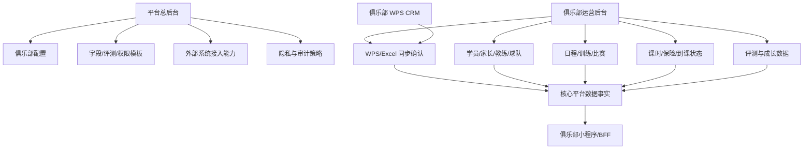

# 通用后台产品设计

本文档设计两个后台：

- 平台总后台：给我们自己的平台运营、实施、技术支持和合规人员使用。
- 俱乐部运营后台：给单个俱乐部的管理员、运营、教练主管和授权人员使用。

重庆天才足球俱乐部的 WPS 在线表格视为第一个俱乐部已有的轻量 CRM/运营后台。平台既要能接入它，也要能逐步提供自己的俱乐部运营后台，最终让 WPS、Excel、后台录入、小程序教练端录入都成为统一数据事实的来源。

## 设计原则

### 1. WPS 是外部 CRM，不是核心模型

天才俱乐部当前用 WPS 维护学员、交费、保险、到课和评分数据，这说明他们已经有一套运营秩序。平台应尊重这套工作流：

- WPS 继续作为俱乐部可用的数据维护入口。
- 平台通过 WPS API、Excel 导入或后台录入吸收数据。
- 数据进入平台后必须经过字段映射、校验、幂等、确认、隐私策略和审计。
- 小程序只读取平台确认后的事实，不直接连接 WPS。

### 2. 后台是产品能力，不是临时管理工具

后台必须承接长期运营：

- 多俱乐部创建、配置、授权、接入和停用。
- 多小程序 client 配置、功能开关、主题和发布状态。
- 学员、家长、教练、球队、日程、训练、比赛、评测、课时、保险等核心业务。
- WPS/Excel/未来飞书等外部系统同步。
- 未成年人隐私、访问审计、导出控制和数据请求。

### 3. 平台总后台与俱乐部运营后台分权

平台总后台管理“平台规则和租户能力”。俱乐部运营后台管理“本俱乐部业务数据”。

俱乐部不能修改平台级字段定义、全局指标标准、跨俱乐部模板或其他俱乐部数据。平台人员进入俱乐部数据详情时必须有目的、权限和审计。

### 4. 俱乐部差异进入配置层

不同俱乐部可以有不同字段、流程、评测视图、小程序外观和同步规则，但差异必须落到：

- `clubId`
- `ClubAppClient`
- feature flag
- custom field
- privacy policy
- metric graph version
- assessment template version
- external mapping
- sync policy

不能为某个俱乐部复制一套独立业务模型。

### 5. 远景入口先规划，能力按阶段开放

后台需要让接入俱乐部看到平台未来演进方向，但不能把未成熟能力伪装成已可用功能。所有远景能力应有统一成熟度状态：

| 状态 | 含义 | 后台展示规则 |
| --- | --- | --- |
| MVP | 当前可用，进入核心交付范围。 | 正常展示，可操作。 |
| Beta | 能力已进入试点，需要平台开通。 | 展示为“试点中”，可申请开通。 |
| Planned | 已进入产品路线图，但未交付。 | 展示为“规划中”，只展示说明和价值。 |
| Locked | 需要套餐、权限、授权或合规条件。 | 展示入口，但不可操作，说明开通条件。 |
| Hidden | 对当前俱乐部不适用。 | 不展示，避免干扰。 |

远景入口不是简单的菜单占位，而是平台叙事的一部分：让俱乐部理解当前使用的学员、日程、训练、评测、课时、保险数据，未来会自然延伸到招生增长、精英球员服务、AI 分析、视频内容、场地运营和商业化服务。

## 两个后台的关系

## 平台总后台

### 目标用户

- 平台 owner
- 平台运营
- 实施顾问
- 技术支持
- 隐私/合规管理员
- 集成管理员

### 首页工作台

平台总后台首页不展示某个俱乐部的业务细节，而展示平台健康状况：

- 俱乐部总数、启用数、试运行数、停用数。
- 小程序 client 数、待配置数、异常数。
- WPS/Excel 同步成功率、失败任务、待处理异常。
- 隐私请求、导出申请、敏感访问异常。
- API 错误、慢接口、同步队列积压、幂等冲突。

### 俱乐部管理

能力：

- 创建俱乐部。
- 设置 `clubCode`、名称、状态、区域、负责人。
- 配置启用模块：日程、训练、比赛、评测、课时、保险、WPS、媒体、AI。
- 配置套餐/服务等级，用于未来商业化。
- 停用或归档俱乐部。

首个俱乐部固定配置：

| 字段 | 值 |
| --- | --- |
| `clubId` | `club-chongqing-talent` |
| `clubCode` | `cq-talent` |
| `clubName` | `重庆天才足球俱乐部` |

### App Client 管理

一个俱乐部可以有多个客户端：

- 微信小程序家长/教练端
- 管理后台
- 公众号
- 抖音/视频号/小红书运营入口
- 未来单独教练端

平台总后台负责：

- 登记 `appId`、`clientKey`、channel。
- 设置入口角色：parent、coach、admin、operator。
- 设置小程序主题、导航、banner 位、功能开关。
- 生成 `/app-clients/resolve` 可识别的配置。
- 查看小程序版本、审核状态和发布记录。

俱乐部可以修改展示内容，但不能自行改变底层业务模型。

### 字段与数据模板中心

平台维护字段分层：

- 标准字段：学员、家长、教练、球队、日程、训练、比赛、评测、课时、保险。
- 标准运营字段：区域、学校、渠道、学员状态、负责教练、沟通阶段。
- 自定义字段：俱乐部个性字段。
- 隐私字段目录：敏感等级、默认可见角色、是否可导出、留存类别。

能力：

- 创建字段模板。
- 将字段分配给俱乐部。
- 将某个俱乐部常用自定义字段升级为平台标准字段。
- 配置导入导出规则。
- 配置字段展示、筛选、必填、校验和隐私等级。

### 评测与指标模板中心

平台维护通用指标资产：

- 指标目录。
- 指标图谱版本。
- 指标依赖和公式。
- 评测模板版本。
- 评测视图。
- 测试项目。
- 训练项目与能力指标关联。

天才精英队评分表作为第一个俱乐部模板导入后，应拆成：

- 平台可复用指标。
- 天才俱乐部专属指标。
- 天才俱乐部专属展示视图。
- 可复制到其他俱乐部的评测模板版本。

平台总后台需要支持模板 fork：

1. 从平台通用模板复制到俱乐部。
2. 俱乐部调整权重、视图或可见性。
3. 调整形成俱乐部版本，不影响平台原模板。
4. 未来可将多个俱乐部反复使用的版本提升为平台模板。

### 集成中心

集成中心管理 WPS/Excel/未来飞书等外部来源。

平台总后台负责：

- 外部系统 provider 管理。
- OAuth/授权方式配置。
- credentialRef 管理。
- webhook secret 和签名策略。
- 全局限流、重试、超时、告警策略。
- 连接健康状态。

俱乐部级配置由俱乐部后台完成，但平台可查看和协助排障。

WPS 作为天才俱乐部 CRM 时，集成中心需要支持：

- WPS connection。
- WPS 表格/工作表识别。
- 表映射：全量用户、交费事件、到课事件、保险购买、评分表。
- 字段映射。
- 身份匹配规则。
- 冲突策略。
- 自动同步策略。
- 手动重跑。
- 同步结果和错误报告。

### 隐私与合规中心

平台总后台负责平台侧未成年人隐私保护。

能力：

- 隐私字段目录。
- 授权 scope 模板。
- 隐私告知版本。
- 敏感访问审计。
- 导出审批。
- 留存 dry-run。
- 匿名化工具。
- 家长数据请求处理监控。

平台人员查看俱乐部敏感数据时必须填写 purpose 并写入审计。技术支持默认看脱敏数据，只有明确授权场景才能查看详情。

### 平台运维中心

能力：

- API 健康检查。
- 同步队列状态。
- WPS 同步任务状态。
- 幂等冲突监控。
- 缓存命中率。
- 慢接口。
- 错误日志。
- 数据库备份和恢复状态。
- OpenAPI 契约版本。

平台总后台的运维中心服务于所有俱乐部，不让单个俱乐部看到其他俱乐部指标。

### 产品路线图与能力市场

平台总后台需要有一个“能力市场/路线图”入口，用来管理平台长期能力和俱乐部可开通模块。

能力分类：

- 基础运营：学员、家长、教练、球队、日程、课时、保险。
- 训练与比赛：训练项目库、训练计划、比赛记录、成长档案。
- 评测与数据：指标图谱、评测模板、成长报告、同龄对比、精英球员档案。
- 外部集成：WPS、Excel、飞书、企业微信、支付、保险、硬件设备。
- AI 能力：AI 表现评价、AI 视频剪辑、AI 成长报告、AI 训练建议。
- 媒体与增长：公众号、视频号、抖音、小红书、招生线索、内容分发。
- 场地与资源：场地排班、场地评价、器材管理、场地成本。
- 商业化：课包、训练营、赛事报名、会员权益、增值服务。

平台总后台负责：

- 定义能力 code。
- 定义能力成熟度。
- 定义依赖条件。
- 定义默认可见角色。
- 定义是否进入某俱乐部套餐。
- 定义是否影响小程序 capabilities。
- 记录俱乐部开通、试点、关闭和升级历史。

### 新俱乐部实施向导

为了支撑批量复制，平台总后台需要提供新俱乐部实施向导：

1. 创建俱乐部。
2. 选择行业模板：青训足球标准版、精英队强化版、校区多点版、赛事型俱乐部版。
3. 复制已有俱乐部配置，例如从重庆天才复制字段、日程类型、评测模板和小程序结构。
4. 配置 App Client：小程序、后台、公众号。
5. 配置数据来源：后台录入、Excel、WPS、未来飞书。
6. 配置隐私与授权 scope。
7. 配置首批角色账号。
8. 完成上线检查：域名、证书、WPS 授权、数据导入、smoke 测试。

这个向导是规模化交付的关键。它能把第一个俱乐部沉淀下来的经验变成可复制方案，而不是每次重新实施。

### 增值服务与精英球员服务配置

平台总后台应预留精英球员增值服务能力：

- 精英球员档案模板。
- 高阶能力评测包。
- 专项训练报告。
- 成长周期报告。
- 比赛表现档案。
- 视频剪辑权益。
- AI 表现分析权益。
- 外部赛事/试训机会记录。
- 家长增值服务可见范围。

这些能力不进入 MVP 操作流，但要在平台总后台中作为 `Planned` 或 `Beta` 能力纳入路线图。未来每个俱乐部可以决定是否开通，平台可以根据服务等级收费。

## 俱乐部运营后台

### 目标用户

- 俱乐部 owner
- 俱乐部管理员
- 运营人员
- 教练主管
- 教练
- 财务/课时核对人员
- 授权数据管理员

### 首页工作台

俱乐部后台首页关注日常动作：

- 今日训练、比赛、其他活动。
- 待确认同步数据。
- WPS 同步异常。
- 课时余额异常。
- 保险即将到期。
- 未绑定微信的家长/教练。
- 待录入评测。
- 缺勤、迟到、请假、扣课异常。

### 学员 CRM

学员 CRM 是俱乐部后台的核心。它承接天才 WPS 全量用户表里的运营价值。

列表能力：

- 姓名、年龄、性别、区域、学校、渠道。
- 学员状态：潜在、试听、在训、暂停、流失、毕业。
- 默认球队、参与球队、负责教练。
- 课时余额、保险状态、最近到课、最近评测。
- 微信绑定状态。
- 最近沟通时间、下次跟进时间。

详情页能力：

- 基础资料。
- 足球档案：惯用脚、位置、水平、身高体重、入训日期。
- 联系人和监护人。
- 运营信息：渠道、区域、学校、负责教练、沟通记录。
- 球队和课程参与。
- 日程和出勤。
- 课时流水。
- 保险记录。
- 训练观察。
- 比赛数据。
- 评测和指标趋势。
- 同步来源和变更历史。

### 家长与联系人管理

能力：

- 一个学员多个联系人。
- 主联系人、备用联系人、接收通知开关。
- 家长微信绑定状态。
- 手机号唯一性和冲突提示。
- 家长可见孩子关系。
- 隐私授权状态。

联系人不是登录账号的简单附属。没有注册过小程序的家长也应能作为联系人存在。

### 教练与团队管理

能力：

- 教练档案。
- 教练角色：主教练、助教、私教、运营兼教练。
- 可管理球队。
- 可查看学员范围。
- 今日课表和历史活动。
- 评测录入权限。
- 比赛记录权限。

球队能力：

- 多球队。
- 精英队、普通班、小班课、私教课。
- 一个学员可属于多个队。
- 队伍有效期。
- 队伍主教练和助教。
- 训练地点和默认训练时段。

### 日程与活动管理

活动类型：

- 训练。
- 比赛。
- 其他活动：外出参观、观看职业比赛、活动营、公开课、通知类活动。

能力：

- 创建普通活动。
- 创建重复训练规则。
- 活动展开。
- 学员、球队、教练、场地参与。
- 冲突检测：同一学员跨队冲突、教练私教/小班课冲突、场地冲突。
- 活动取消、改期和通知状态。
- 活动关联训练内容、能力指标、课时扣减规则。

日程后台是小程序日程 Tab 的权威来源。

### 训练管理

能力：

- 训练项目库。
- 训练项目关联能力指标。
- 训练课程由多个训练项目组成。
- 训练周期目标。
- 每次训练 session 绑定日程活动。
- 点名。
- 训练观察。
- 与评测指标关联。

教练端小程序可以录入点名和训练观察，但训练项目库、课程结构和周期目标应在后台配置。

### 比赛管理

能力：

- 比赛活动创建。
- 对手、比分、比赛形式。
- 出场名单。
- 进球、助攻等事件。
- 教练备注。
- 比赛事件生成对应 `PlayerMetricRecord`。
- 家长端只读展示比赛摘要和孩子相关表现。

比赛不是 MVP 之外的附属功能。日常青训球队必须有比赛记录，且比赛数据会进入能力追踪。

### 课时与保险状态

MVP 不做线上支付、在线投保和财务结算，但必须管理状态流转。

课时能力：

- 线下交费确认。
- 课时入账。
- 到课消课。
- 手工调整。
- 课时余额。
- 变更来源：WPS、Excel、后台、系统生成。
- 审核状态和审计。

保险能力：

- 投保状态。
- 保单号。
- 保险公司。
- 生效/到期日期。
- 审核状态。
- 到期提醒。
- 来源和审计。

家长端显示的是状态摘要，不显示财务审核详情。

### WPS/Excel 同步管理

这是天才俱乐部早期最关键的后台能力。

页面：

- 连接状态。
- 表格映射。
- 字段映射。
- 同步策略。
- 手动同步。
- 最近同步。
- 错误报告。
- raw record 预览。
- 待确认记录。
- 确认入库。

同步策略：

- 手动。
- 定时。
- webhook 触发。
- 禁用。

应用策略：

- 全部人工确认。
- 校验通过自动入库。
- 高风险字段人工确认。
- 冲突进入待处理。

俱乐部后台只看到自己俱乐部的连接和同步数据。WPS 凭据不在前端暴露，只显示连接状态和授权提示。

### 评测与成长管理

能力：

- 评测模板选择。
- 评测批次。
- 原始测试项录入。
- 教练评分。
- 公式计算。
- 指标图谱结果。
- lineage 查看。
- 家长可见范围配置。
- 推荐训练项目关联。

俱乐部可以使用平台模板，也可以基于模板生成俱乐部版本。俱乐部不直接编辑平台全局指标，只编辑自己版本。

### 小程序内容与展示配置

俱乐部后台可以管理小程序展示内容：

- Banner。
- 通知。
- 俱乐部介绍。
- 青训帮助内容。
- 家长端可见指标。
- 保险/课时是否展示。
- 日程活动展示规则。
- 主题色和基础品牌信息。

不能在俱乐部后台直接改变核心模型或绕过隐私策略。

### 隐私与数据请求

俱乐部后台需要处理本俱乐部家长数据请求：

- 更正。
- 删除/匿名化申请。
- 撤回授权。
- 限制处理。
- 获取副本。

后台操作必须有审计。家长撤回媒体/AI 授权后，小程序能力配置应立即关闭相关入口。

### 招生与线索管理

招生 CRM 是远景能力，但后台需要预留入口，因为很多俱乐部会把“学员运营”和“招生转化”混在一起管理。

规划能力：

- 线索来源：自然到访、转介绍、学校合作、活动报名、公众号、小红书、抖音、视频号。
- 试听预约。
- 试听课安排。
- 试听反馈。
- 转化状态：新线索、已联系、已预约、已试听、已报名、无效。
- 跟进任务。
- 招生渠道转化分析。

MVP 不做复杂招生自动化，但学员 CRM 的渠道、状态、沟通记录必须能承接未来招生线索升级。

### 媒体与内容运营

俱乐部后台应预留媒体运营入口，服务公众号、视频号、抖音和小红书等内容渠道。

规划能力：

- 训练/比赛素材库。
- 学员媒体授权状态。
- 精彩片段候选。
- 内容发布计划。
- 公众号图文素材。
- 视频号/抖音/小红书素材状态。
- 家长可分享内容。

MVP 只做授权闸门和内容展示配置，不做自动发布。未来 AI 视频剪辑上线前，必须检查媒体采集、公开传播和 AI 视频 scope。

### AI 运动表现与成长报告

AI 能力是平台远景中的重要增值服务，但必须建立在指标图谱、训练记录、比赛记录、视频素材和授权 scope 上。

规划能力：

- AI 表现分析任务。
- 视频或比赛记录输入。
- 分析结果审核。
- AI 生成成长报告。
- AI 训练建议。
- 教练确认和修正。
- 家长可见版本。

AI 输出不能直接覆盖教练结论。后台必须保留“AI 生成、教练确认、家长展示”三段式流程。

### 场地与资源管理

场地管理是远景能力，既服务排课，也服务成本和体验评价。

规划能力：

- 场地档案。
- 场地排班。
- 场地冲突。
- 场地费用。
- 场地评价。
- 器材管理。
- 天气或临时关闭提醒。

MVP 日程冲突需要预留 `venueId` 和场地名称。完整场地运营可以后置。

### 赛事与营期管理

俱乐部未来可能运营训练营、杯赛、外出比赛和职业比赛参观活动。

规划能力：

- 赛事/营期项目。
- 报名名单。
- 分组和队伍。
- 费用状态。
- 日程安排。
- 成绩记录。
- 媒体素材。
- 家长通知。

MVP 中这类活动先归入“其他活动”或“比赛”，但后台导航应预留独立模块，便于未来从日程中拆出更完整的赛事运营。

### 商业化与会员权益

MVP 不做线上支付和财务结算，但俱乐部会关心未来商业化能力。

规划能力：

- 课包产品。
- 训练营产品。
- 赛事报名产品。
- 精英服务包。
- 会员权益。
- 优惠和赠课。
- 线上支付。
- 对账和退款。

当前阶段只展示“线下确认状态”和“课时余额”。未来启用线上支付时，订单、支付、退款、课时入账仍由核心平台统一处理，小程序只做支付发起和结果展示。

### 数据分析中心

俱乐部运营后台应预留数据分析入口，让俱乐部看到平台数据沉淀的长期价值。

规划看板：

- 学员增长。
- 到课率。
- 课时消耗。
- 保险到期。
- 训练参与。
- 比赛参与。
- 评测完成率。
- 能力成长趋势。
- 教练工作量。
- 渠道转化。
- 精英球员池。

MVP 可以先提供少量运营摘要，完整分析中心后置。

## 权限模型

### 平台总后台角色

| 角色 | 能力 |
| --- | --- |
| platform_owner | 全平台配置、俱乐部创建、角色授权、敏感策略。 |
| platform_operator | 俱乐部实施、配置、模板分配、同步排障。 |
| platform_support | 查看脱敏数据、处理工单、不能导出敏感数据。 |
| platform_privacy_admin | 隐私策略、审计、导出审批、数据请求监管。 |
| platform_integration_admin | WPS/外部系统连接、凭据引用、webhook、安全策略。 |

### 俱乐部后台角色

| 角色 | 能力 |
| --- | --- |
| club_owner | 本俱乐部全量配置和授权。 |
| club_admin | 学员、家长、教练、球队、日程、同步确认。 |
| club_operator | 学员 CRM、沟通、WPS 异常、课时/保险状态维护。 |
| head_coach | 球队、训练、比赛、评测管理。 |
| coach | 自己相关活动、点名、训练观察、比赛事件、评测录入。 |
| finance_operator | 线下收费确认、课时入账、审核状态，不能修改评测。 |
| privacy_operator | 本俱乐部隐私请求处理和导出申请。 |

角色可以叠加，但所有敏感操作必须写审计。

## 与小程序的关系

后台是小程序的配置和事实来源。

小程序依赖后台产出：

- 俱乐部能力配置。
- App client 配置。
- Banner 和内容。
- 家长/教练身份绑定资料。
- 孩子、球队、日程、训练、比赛、评测。
- 课时和保险状态。
- 隐私授权状态。
- 家长可见指标和页面入口。

小程序不能替代后台：

- 不做 WPS 字段映射。
- 不做同步确认。
- 不做敏感导出。
- 不做平台模板配置。
- 不做俱乐部权限配置。
- 不做财务/保险审核。

## 后端 API 对齐

当前已有基础：

- `/clubs/:clubId/admin/app-clients`
- `/clubs/:clubId/admin/integrations/connections`
- `/clubs/:clubId/admin/integrations/sync-policies`
- `/clubs/:clubId/admin/students`
- `/clubs/:clubId/admin/privacy`
- `/clubs/:clubId/admin/sync-runs`
- `/clubs/:clubId/admin/import-preview`
- `/clubs/:clubId/admin/calendar/events`
- `/clubs/:clubId/training/...`
- `/clubs/:clubId/matches...`
- `/clubs/:clubId/assessments...`
- `/clubs/:clubId/app-clients/:clientId/...`

需要补齐或产品化：

- 平台级 `/platform/admin/clubs`。
- 平台级模板中心 API。
- 平台级指标模板和俱乐部 fork API。
- 俱乐部后台 Dashboard 聚合 API。
- 学员 CRM 高级筛选 API。
- 联系人、沟通记录、跟进任务 API。
- 训练项目库和训练课程配置 API。
- Banner/内容管理 API。
- 小程序版本和发布记录 API。
- 平台运维健康聚合 API。

## MVP 后台范围

### 必做

平台总后台：

- 俱乐部管理。
- App client 管理。
- WPS 连接和同步健康查看。
- 字段映射模板查看。
- 隐私审计查看。

俱乐部运营后台：

- 学员 CRM 列表和详情。
- 家长/联系人管理。
- 教练/球队管理。
- 日程活动管理。
- 训练点名和训练观察查看。
- 比赛记录查看和修正。
- 课时/保险状态查看和人工修正。
- WPS 同步运行、错误处理和确认入库。
- 评测模板查看、评测记录查看。
- 小程序 Banner 和基础内容配置。

### 暂缓

- 完整财务结算。
- 在线支付后台。
- 在线投保后台。
- AI 视频剪辑后台。
- AI 表现评价后台。
- 营销自动化。
- 复杂招生 CRM 自动化。
- 多云成本计费。

## 开发阶段

### 阶段 1：后台 API 契约补齐

- 确认平台总后台和俱乐部后台的 route 命名。
- 补齐 Dashboard 聚合接口。
- 补齐学员 CRM 查询条件。
- 补齐联系人和沟通记录接口。
- 补齐 Banner/内容配置接口。
- 补齐训练项目库接口。
- 补齐评测模板 fork 和俱乐部版本接口。

### 阶段 2：俱乐部运营后台 MVP

优先做俱乐部后台，因为天才俱乐部要先落地业务：

- 登录和角色。
- 工作台。
- 学员 CRM。
- 日程。
- WPS 同步确认。
- 课时/保险状态。
- 评测查看。

### 阶段 3：平台总后台 MVP

- 俱乐部管理。
- App client 管理。
- 模板中心。
- 集成中心。
- 隐私与审计。
- 运维状态。

### 阶段 4：规模化复制

- 新俱乐部创建向导。
- 从重庆天才复制配置。
- 字段/评测/小程序 client 模板化。
- 小程序发布流水线。
- 第三方平台代开发能力评估。

## 产品判断

天才俱乐部的 WPS 不是临时表格，而是一个真实俱乐部的运营系统。我们不能简单要求他们停用，也不能让小程序直接依赖它。

正确路径是：

1. 接入 WPS，尊重现有工作流。
2. 建立俱乐部运营后台，承接 WPS 里的高价值操作。
3. 用平台总后台管理多俱乐部复制、模板、隐私和集成。
4. 让 WPS 从“唯一 CRM”逐步变成“可选数据源”。

这样平台既能服务第一个客户，也能形成可复制的多俱乐部产品能力。
