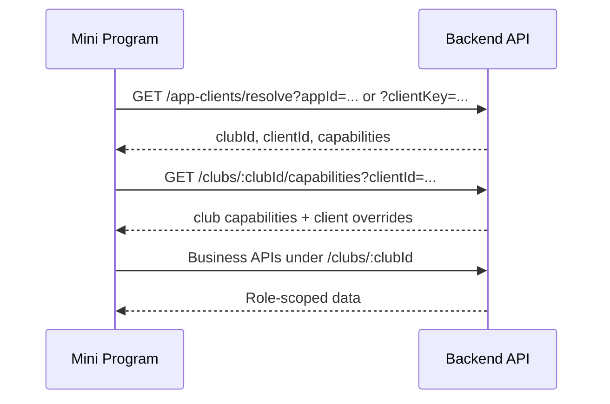

# 重庆天才小程序产品设计规格

## 范围与原则

本规格面向第一个小程序客户端：重庆天才足球俱乐部。固定种子身份仅用于首个客户端配置与验收：

- `clubId`: `club-chongqing-talent`
- `clubCode`: `cq-talent`
- `clubName`: `重庆天才足球俱乐部`

小程序不得写死重庆天才的业务字段、课时规则、评测项、比赛事件类型或家长可见范围。运行时必须先通过 `appId` 或 `clientKey` 解析出 `clubId`、`clientId` 和 `capabilities`，再按能力开关消费俱乐部作用域业务 API。

本规格只覆盖小程序产品设计、信息架构、页面流程和接口消费说明。不做视觉 UI，不写小程序代码，不新增后端模型。WPS、Excel、字段映射、同步策略、线下收费确认、保险确认等仍属于后台和集成能力；小程序只消费允许展示或写入的业务事实。

## 用户与入口

### 家长端

目标用户是已绑定学员的家长。核心任务是查看孩子近期安排、训练/比赛摘要、能力成长和保险/课时状态。

权限基线：

- 只能访问 guardian binding 绑定的孩子。
- 可以读取孩子日程、活动详情、训练/比赛摘要、能力趋势、允许展示的保险/课时状态。
- 不能写入训练、比赛、评测、课时、保险、收费、WPS 同步或后台确认状态。

### 教练端

目标用户是俱乐部教练。核心任务是当天上课、点名、记录训练观察、记录比赛事件、录入评测。

权限基线：

- 可以读取本人负责或被授权的今日活动。
- 可以写入活动点名、训练观察、比赛摘要/事件、评测记录。
- 不能管理 WPS 连接、字段映射、收费确认、保险审核、球队基础档案和家长绑定关系。

### 身份切换

同一微信用户可能同时有家长和教练身份。小程序启动后按 membership roles 和 `capabilities.client.roleEntrypoints` 决定默认入口：

1. 只有 `parent`：进入家长端首页。
2. 只有 `coach`：进入教练端今日课表。
3. 同时有 `parent` 和 `coach`：显示角色切换入口，并记住最近一次选择。
4. 没有 active membership：进入无权限状态，不允许访问业务页。

## 启动流程

### 运行时上下文

小程序启动时只允许本地持有客户端身份：

- `appId`: 微信小程序平台提供的应用身份，或
- `clientKey`: 后端为该小程序配置的稳定客户端 key。

不允许在页面、请求封装或本地缓存中硬编码 `clubId=club-chongqing-talent` 作为业务入口。`clubId` 只能来自 resolve/capabilities 响应。

### Bootstrap 顺序



### Bootstrap 数据

`/app-clients/resolve` 需要返回：

- `clubId`
- `clientId`
- `capabilities`

`/clubs/:clubId/capabilities?clientId=...` 需要供小程序读取：

- `features`: `training`、`matches`、`assessments`、`derived_metrics`、`private_lessons` 等开关。
- `roles.parent`: 家长端能力，例如 `calendar.read_child`、`training.read_summary`、`match.read_summary`、`assessment.read_trend`、`operations.read_offline_status`。
- `roles.coach`: 教练端能力，例如 `calendar.read`、`attendance.write`、`training_observation.write`、`match_event.write`、`assessment.write`。
- `calendar.eventTypes`、`calendar.participantStatuses`。
- `operations.standardFields`、`operations.offlineStatuses`，仅作为展示字段目录，不代表家长端一定可见。
- `assessment.views`、`assessment.templateVersions`、`assessment.metricBindings`。
- `client.navigation`、`client.roleEntrypoints`、`client.visibility`。

### 本地缓存策略

- 可以缓存 `clubId`、`clientId`、`capabilities` 和用户选择的角色入口。
- 缓存必须有过期策略；启动、登录态恢复、403/404 能力失败时重新 resolve。
- 不缓存 WPS 连接、字段映射、同步策略、收费凭证、保险审核明细。

### 启动错误状态

| 场景 | 触发条件 | 小程序处理 |
| --- | --- | --- |
| 客户端不存在 | `/app-clients/resolve` 返回 404 | 展示“当前小程序未开通俱乐部服务”，提供重试和联系客服入口。 |
| 参数缺失 | resolve 返回 400 | 展示配置错误，不进入业务页。 |
| 无俱乐部权限 | capabilities 或业务 API 返回 403 | 清理当前业务上下文，展示“账号未绑定俱乐部身份”。 |
| 俱乐部停用或能力缺失 | capabilities 缺少必需 feature/role permission | 对应模块隐藏；若首页无可用模块，展示“暂未开放”。 |
| 网络失败 | 请求超时或离线 | 保留最近一次只读缓存，标记数据可能不是最新；写入页禁用提交。 |

## 信息架构

### 家长端导航

建议 3 个主入口：

1. 首页：孩子卡片、今日/近期安排、保险/课时提醒、成长摘要。
2. 日程：孩子日程列表和活动详情。
3. 成长：能力趋势、训练/比赛摘要、评测记录入口。

保险/课时状态不建议作为独立一级 Tab，除非 `client.visibility` 明确要求高频展示。默认放在首页提醒和孩子状态详情内。

### 教练端导航

建议 3 个主入口：

1. 今日：今日课表、待办状态、快速进入点名/记录。
2. 活动：活动详情、点名、训练观察、比赛记录。
3. 评测：待评测学员、评测模板、评测录入。

教练端以“今天要完成什么”为主，不做后台式全量管理。

## 家长端页面规格

### 1. 首页

页面目标：

- 让家长快速知道孩子今天/近期有没有课、是否有比赛、是否有保险或课时风险、最近成长是否有更新。

主要模块：

- 孩子选择器：绑定多个孩子时显示。
- 今日/下次活动：活动类型、时间、地点、队伍、状态。
- 状态提醒：课时余额、保险状态、保险到期日。
- 最近训练/比赛摘要：最近一次训练观察或比赛事件摘要。
- 能力成长入口：最新指标更新时间和关键趋势。

数据来源：

- `GET /clubs/:clubId/app-clients/:clientId/parent/students/:studentId/home`
- `GET /clubs/:clubId/capabilities?clientId=...`

权限边界：

- 只能请求当前家长绑定的 `studentId`。
- 如果 `operations.read_offline_status` 不存在，隐藏课时和保险模块。
- 如果 `assessment.read_trend` 不存在，隐藏成长摘要。

空状态：

- 无绑定孩子：展示“当前账号还没有绑定学员”，引导联系俱乐部。
- 无近期活动：展示“近期暂无安排”，保留成长和状态模块。
- 无指标记录：展示“暂无成长记录，完成训练或评测后会更新”。
- 无课时/保险数据：显示“俱乐部暂未同步该状态”，不要显示为 0 或过期。

错误状态：

- 403：提示账号无权查看该孩子，回到孩子选择或无权限页。
- 404：提示学员资料不存在或已停用。
- 网络失败：展示最近缓存和刷新按钮；保险/课时状态需标注“未刷新”。

### 2. 孩子日程

页面目标：

- 按时间查看孩子训练、比赛和其他活动。

主要模块：

- 周/月切换。
- 活动列表：训练、比赛、其他活动。
- 状态筛选：已确认、待确认、请假、已完成等，状态值来自 `capabilities.calendar.participantStatuses`。
- 活动详情入口。

数据来源：

- `GET /clubs/:clubId/app-clients/:clientId/parent/students/:studentId/schedule`
- `GET /clubs/:clubId/capabilities?clientId=...`

权限边界：

- 家长只能看自己孩子参与的活动，不调用全俱乐部日历作为主数据源。
- 活动字段展示受 `client.visibility` 和后端响应裁剪约束。

空状态：

- 所选日期无活动：显示“这一天没有训练或比赛”。
- 能力未启用：如果 calendar 权限不存在，隐藏日程入口。

错误状态：

- 数据加载失败：保留日期选择器，活动列表展示重试。
- 部分活动详情缺失：列表保留基础时间和标题，详情页展示缺失提示。

### 3. 活动详情

页面目标：

- 告知家长活动时间、地点、类型、参与状态和活动后的摘要。

主要模块：

- 基础信息：标题、类型、时间、地点、队伍、教练、状态。
- 参与状态：`invited`、`confirmed`、`present`、`absent`、`late`、`leave_requested`、`excused` 等。
- 训练详情：训练类型、强度、训练观察摘要。
- 比赛详情：对手、比分、孩子比赛事件或教练备注。
- 关联状态：活动是否产生课时扣减，只展示状态，不展示收费明细。

数据来源：

- `GET /clubs/:clubId/app-clients/:clientId/events/:eventId`
- `GET /clubs/:clubId/students/:studentId/status-summary`，用于活动后状态提醒。
- `GET /clubs/:clubId/students/:studentId/metrics?source=training_observation` 或 `source=match_event`。

权限边界：

- 家长不能修改点名状态。
- 家长不能查看其他学员名单、内部教练观察原文，除非后端明确返回家长可见摘要。

空状态：

- 活动未开始：展示基础信息和参与状态。
- 活动已结束但无摘要：展示“教练暂未发布活动摘要”。
- 训练/比赛模块未启用：只展示基础活动信息。

错误状态：

- event 不属于孩子：403。
- event 已删除或不可见：404。
- 摘要加载失败：保留基础信息，摘要模块单独重试。

### 4. 训练/比赛摘要

页面目标：

- 以家长可理解的方式回顾孩子近期参与情况，不暴露教练端原始工作台。

主要模块：

- 时间线：最近训练、比赛。
- 训练摘要：观察指标、评分、标签、可见备注。
- 比赛摘要：出场、进球、助攻、关键事件、教练备注。
- 能力记录来源标识：训练观察、比赛事件、评测。

数据来源：

- `GET /clubs/:clubId/students/:studentId/timeline`
- `GET /clubs/:clubId/students/:studentId/metrics?source=training_observation`
- `GET /clubs/:clubId/students/:studentId/metrics?source=match_event`
- `GET /clubs/:clubId/catalog/ability-metrics`

权限边界：

- 只展示与当前孩子相关的摘要。
- `training.read_summary` 缺失时隐藏训练摘要。
- `match.read_summary` 缺失时隐藏比赛摘要。

空状态：

- 无训练记录：提示完成训练后更新。
- 无比赛记录：提示暂无比赛摘要。
- 有活动但无指标：提示教练暂未记录观察。

错误状态：

- 指标目录加载失败：摘要仍可按原始记录展示 metricId 占位，但需要提示“部分指标名称暂不可用”。

### 5. 能力成长

页面目标：

- 展示孩子能力记录、评测趋势和派生指标结果。

主要模块：

- 指标视图：按 `capabilities.assessment.views` 和 `viewNodes` 分组。
- 趋势列表：每个指标的最近记录、来源、时间、值。
- 评测记录：评测模板、评测时间、教练、摘要。
- 派生指标：仅展示后端已计算的 `PlayerMetricRecord`，不在小程序端自行计算。

数据来源：

- `GET /clubs/:clubId/catalog/ability-metrics`
- `GET /clubs/:clubId/students/:studentId/metrics`
- `GET /clubs/:clubId/capabilities?clientId=...`

权限边界：

- `assessment.read_trend` 缺失时隐藏。
- 家长端不能调用派生指标写入接口。
- 指标可见范围以后端响应和 `parent_visibility` 策略为准。

空状态：

- 无指标目录：展示“俱乐部暂未配置成长指标”。
- 有目录无记录：展示“暂无成长记录”。
- 只有部分来源记录：按来源分组展示，不强行补齐。

错误状态：

- metrics 请求失败：展示重试。
- capability 中评测视图缺失：降级为按指标类别或来源列表展示。

### 6. 保险/课时状态

页面目标：

- 展示线下流程同步后的运营状态，帮助家长理解是否需要联系俱乐部处理。

主要模块：

- 剩余课时：`lessonBalance`。
- 保险状态：`active`、`expired`、`unknown` 等。
- 到期日、保单号、审核状态：仅在后端允许家长可见时展示。
- 更新时间和来源提示：如果后端提供。

数据来源：

- `GET /clubs/:clubId/app-clients/:clientId/parent/students/:studentId/home`
- `GET /clubs/:clubId/students/:studentId/status-summary`
- `GET /clubs/:clubId/capabilities?clientId=...`

权限边界：

- 家长端只读。
- 不展示收费金额、支付凭证、审核人员、WPS 原始记录、外部同步错误。
- 不提供在线支付、在线投保、退款、发票或结算入口。

空状态：

- `lessonBalance` 缺失：展示“课时状态待同步”。
- `insurance.status=unknown`：展示“保险状态待确认”。
- capability 未开放：不显示该模块。

错误状态：

- 状态接口 404：学员不存在或无绑定。
- 状态接口 403：无权查看。
- 网络失败：展示最近缓存，并标注“状态可能不是最新”。

## 教练端页面规格

### 1. 今日课表

页面目标：

- 让教练看到当天需要处理的训练、比赛和待办状态。

主要模块：

- 日期切换，默认当天。
- 活动列表：时间、类型、队伍、地点、人数、状态。
- 工作流状态：待点名、待训练记录、待比赛事件、待评测。
- 快捷入口：点名、训练观察、比赛记录、评测录入。

数据来源：

- `GET /clubs/:clubId/app-clients/:clientId/coach/home?date=YYYY-MM-DD`
- `GET /clubs/:clubId/capabilities?clientId=...`

权限边界：

- 需要 `coach` 或 admin/operator 等授权角色。
- 普通教练默认只看本人负责活动；admin/operator 可看全量，具体以后端返回为准。
- capability 缺少对应写入权限时隐藏入口。

空状态：

- 当天无课：显示“今天没有安排”。
- 只有已完成活动：列表保留，待办状态显示已完成。

错误状态：

- 403：无教练权限。
- 网络失败：保留日期选择和重试；写入入口禁用。

### 2. 活动点名

页面目标：

- 快速记录活动参与状态，为课时扣减和活动事实提供输入。

主要模块：

- 活动基础信息。
- 学员名单：姓名、队伍、当前状态。
- 状态操作：到课、迟到、缺席、请假、免扣等，状态值来自 `capabilities.calendar.participantStatuses`。
- 批量操作：全部到课、清空未提交变更。

数据来源：

- `GET /clubs/:clubId/app-clients/:clientId/coach/home?date=...` 中的活动 students/participants。
- `GET /clubs/:clubId/app-clients/:clientId/events/:eventId` 补全活动详情。
- `PUT /clubs/:clubId/admin/calendar/events/:eventId/participants`

权限边界：

- 需要 `attendance.write`。
- 只能对当前俱乐部和有权限活动写入。
- 课时扣减由后端根据点名事实和规则处理，小程序不直接写 lesson ledger。

空状态：

- 活动无学员：提示“该活动暂无学员名单”，禁用提交。
- 活动已取消：只读展示，不允许点名。

错误状态：

- 提交 400：展示具体校验错误，例如状态值无效。
- 提交 403：提示无权点名。
- 并发更新：提示重新加载名单后再提交。

### 3. 训练观察

页面目标：

- 在训练活动下为学员记录指标观察、评分、标签和备注。

主要模块：

- 训练活动信息：类型、强度、队伍、学员。
- 指标选择：来自能力指标目录和训练/评测配置，不写死重庆天才字段。
- 学员快速切换。
- 评分/数值输入：按 metric `valueKind` 决定输入方式。
- 标签和备注。

数据来源：

- `GET /clubs/:clubId/app-clients/:clientId/coach/home?date=...`
- `GET /clubs/:clubId/app-clients/:clientId/events/:eventId`
- `GET /clubs/:clubId/catalog/ability-metrics`
- `POST /clubs/:clubId/training/sessions/:trainingSessionId/observations`

提交字段：

- `studentId`
- `coachId`
- `metricId`
- `rating` 或 `value`
- `tags`
- `note`

权限边界：

- 需要 `training_observation.write`。
- 只能对训练活动和活动内学员记录。
- 小程序不生成新指标，不修改评测图谱。

空状态：

- 活动没有 `trainingSessionId`：提示“训练记录尚未初始化”，需要后端或后台先创建训练 session。
- 没有可用指标：提示“俱乐部暂未配置训练观察指标”。
- 学员名单为空：禁用记录。

错误状态：

- 400：指标不存在、评分范围错误、训练 session 无效。
- 403：无写入权限。
- 离线：允许本地草稿，但必须明确“未提交”；恢复网络后由用户主动提交。

### 4. 比赛事件记录

页面目标：

- 记录比赛摘要、阵容、关键事件和队员备注。

主要模块：

- 比赛基础信息：对手、主客/类型、比分、状态。
- 阵容：首发、位置、出场时间。
- 事件：进球、助攻、扑救、抢断、黄牌、红牌、点球、乌龙等，具体事件类型以后端 policy/capability 为准。
- 队员备注。

数据来源：

- `GET /clubs/:clubId/app-clients/:clientId/coach/home?date=...`
- `GET /clubs/:clubId/app-clients/:clientId/events/:eventId`
- `GET /clubs/:clubId/capabilities?clientId=...`，读取 match event policy。
- `POST /clubs/:clubId/matches`

提交字段：

- `eventId`
- `matchType`
- `status`
- `opponentName`
- `homeScore`
- `awayScore`
- `rosters[]`
- `events[]`
- `notes[]`

权限边界：

- 需要 `match_event.write`。
- 事件类型和可关联指标不得在小程序写死。
- 小程序只记录比赛事实；指标转化由后端 match service 负责。

空状态：

- 今日无比赛：比赛入口为空状态。
- 比赛未创建 event：不能进入记录页。
- 无参赛名单：允许先记录比分和摘要，但阵容模块提示缺少名单。

错误状态：

- 400：事件类型、学员、关联指标无效。
- 403：无比赛记录权限。
- 已提交后再次编辑：若后端未提供编辑接口，页面只展示已记录结果，不提供覆盖写入。

### 5. 评测录入

页面目标：

- 按俱乐部配置的评测模板录入学员评测分数，并触发后端指标记录和图谱计算。

主要模块：

- 评测模板选择：来自 `capabilities.assessment.templateVersions`。
- 学员选择：来自活动学员或教练授权范围。
- 评测项：由 `metricBindings` 和指标目录决定。
- 分数/原始结果输入：按绑定的 `valueKind` 展示。
- 评语和提交确认。

数据来源：

- `GET /clubs/:clubId/capabilities?clientId=...`
- `GET /clubs/:clubId/catalog/ability-metrics`
- `GET /clubs/:clubId/app-clients/:clientId/coach/home?date=...`
- `POST /clubs/:clubId/assessments`

提交字段：

- `studentId`
- `templateId`
- `templateVersionId`
- `assessedByCoachId`
- `assessedAt`
- `eventId`
- `summary`
- `scores[]`
- `rawResults[]`

权限边界：

- 需要 `assessment.write`。
- 小程序不创建模板、不修改指标绑定、不执行本地图谱计算。
- 家长端不能进入评测录入。

空状态：

- 无评测模板：提示“俱乐部暂未配置评测模板”。
- 模板无指标绑定：提示“模板配置不完整”，不允许提交。
- 活动无学员：提示“没有可评测学员”。

错误状态：

- 400：模板版本不存在、metric 不属于模板、分值格式错误。
- 403：无评测权限。
- 计算失败：展示后端错误，不在小程序端补算。

## 页面到接口映射

| 页面 | 必需接口 | 可选/补充接口 |
| --- | --- | --- |
| 启动 | `GET /app-clients/resolve`、`GET /clubs/:clubId/capabilities?clientId=...` | `GET /clubs/:clubId/config` 仅限有 membership 且需要基本俱乐部配置时 |
| 家长首页 | `GET /clubs/:clubId/app-clients/:clientId/parent/students/:studentId/home` | `GET /clubs/:clubId/students/:studentId/status-summary` 用于局部刷新 |
| 孩子日程 | `GET /clubs/:clubId/app-clients/:clientId/parent/students/:studentId/schedule` | `from`、`to` 范围过滤 |
| 活动详情 | `GET /clubs/:clubId/app-clients/:clientId/events/:eventId` | 家长端由后端校验孩子参与关系 |
| 训练/比赛摘要 | `GET /clubs/:clubId/students/:studentId/metrics?source=...`、`GET /clubs/:clubId/catalog/ability-metrics` | 家长可见活动摘要 BFF |
| 能力成长 | `GET /clubs/:clubId/catalog/ability-metrics`、`GET /clubs/:clubId/students/:studentId/metrics` | 指标视图聚合 BFF |
| 保险/课时状态 | `GET /clubs/:clubId/app-clients/:clientId/parent/students/:studentId/home` | `GET /clubs/:clubId/students/:studentId/status-summary` 用于局部刷新 |
| 教练今日课表 | `GET /clubs/:clubId/app-clients/:clientId/coach/home?date=...` | 教练周课表 BFF |
| 活动点名 | `GET /clubs/:clubId/app-clients/:clientId/coach/home?date=...`、`GET /clubs/:clubId/app-clients/:clientId/events/:eventId`、`PUT /clubs/:clubId/admin/calendar/events/:eventId/participants` | 单活动工作台 BFF |
| 训练观察 | `GET /clubs/:clubId/catalog/ability-metrics`、`POST /clubs/:clubId/training/sessions/:trainingSessionId/observations` | 训练 session 自动创建/读取接口 |
| 比赛事件记录 | `POST /clubs/:clubId/matches` | 比赛详情读取/编辑接口 |
| 评测录入 | `GET /clubs/:clubId/capabilities?clientId=...`、`GET /clubs/:clubId/catalog/ability-metrics`、`POST /clubs/:clubId/assessments` | 按模板读取评测项 BFF |

## 通用权限与状态处理

### 权限处理

- 所有业务请求必须使用 resolve 得到的 `clubId`。
- 请求体中的 `studentId`、`eventId`、`teamId`、`coachId` 由后端验证是否属于同一俱乐部。
- 403 不做静默重试；应提示无权限并重新拉取 capabilities。
- 404 对家长端优先解释为“资料不可见或不存在”，不要泄露其他学员或活动是否存在。

### capability 降级

- feature 未启用：隐藏模块入口。
- role permission 未启用：隐藏操作按钮，保留只读信息。
- client visibility 不允许：不展示相应字段。
- capability 缺字段：采用最小可用页面，不在小程序内补业务默认值。

### 空状态文案原则

- 区分“没有数据”“暂未同步”“无权限”“功能未开放”。
- 不把 `undefined` 课时显示为 0。
- 不把未知保险状态显示为已过期。
- 不提示用户到小程序完成支付、投保、退款或发票申请，除非未来后端 capability 明确开放。

### 错误格式

后端错误统一使用：

```json
{
  "error": {
    "code": "bad_request",
    "message": "Request validation failed",
    "details": []
  }
}
```

小程序展示优先使用 `error.message`，分支处理使用 `error.code`。`details` 只用于调试或表单字段定位，不直接整段展示给家长。

## 后端 BFF/API 剩余缺口清单

以下为小程序体验所需的接口需求，反馈给总控评估，不要求本规格新增后端模型。

已由当前后端首版覆盖：

- 家长首页聚合：`GET /clubs/:clubId/app-clients/:clientId/parent/students/:studentId/home`
- 家长孩子日程：`GET /clubs/:clubId/app-clients/:clientId/parent/students/:studentId/schedule`
- 角色裁剪活动详情：`GET /clubs/:clubId/app-clients/:clientId/events/:eventId`
- 教练今日工作台：`GET /clubs/:clubId/app-clients/:clientId/coach/home`

1. 家长端孩子列表/当前绑定关系接口
   - 需求：登录后获取当前家长可见的 child list，用于首页孩子选择。
   - 建议形态：`GET /clubs/:clubId/me/children`。
   - 原因：现有页面规格需要 `studentId`，但小程序启动后需要从后端获得可访问孩子集合，不能由前端猜测。

2. 家长可见训练/比赛摘要 BFF
   - 需求：聚合活动、训练观察、比赛事件、指标名称和家长可见备注。
   - 建议形态：`GET /clubs/:clubId/students/:studentId/activity-summaries?from=&to=&type=`。
   - 原因：直接拉 timeline + metrics 需要小程序端做过多关联，且难以统一家长可见范围。

3. 能力成长聚合 BFF
   - 需求：按 assessment view/viewNodes 输出家长可见指标、最近值、趋势和来源。
   - 建议形态：`GET /clubs/:clubId/students/:studentId/growth-summary`。
   - 原因：小程序不应自行解释指标图谱或计算派生趋势。

4. 教练单活动工作台 BFF
   - 需求：一次性返回活动详情、学员名单、参与状态、训练 session、比赛记录状态、评测待办。
   - 建议形态：`GET /clubs/:clubId/coach/events/:eventId/workbench`。
   - 原因：`coach/today` 适合列表，但点名、训练观察、比赛记录、评测页需要稳定的单活动上下文。

5. 训练 session 读取/初始化接口
   - 需求：教练从训练活动进入观察页时能获得 `trainingSessionId`，必要时按 event 初始化。
   - 建议形态：`GET /clubs/:clubId/training/sessions?eventId=...` 或后端在训练活动创建时保证 session 存在。
   - 原因：现有 observation 写入依赖 `trainingSessionId`，但小程序不应自行创建或猜测。

6. 比赛详情读取/编辑策略接口
   - 需求：读取已提交比赛记录；若允许编辑，需要明确编辑接口和版本/并发策略。
   - 建议形态：`GET /clubs/:clubId/matches?eventId=...`、`PATCH /clubs/:clubId/matches/:matchId`。
   - 原因：现有 `POST /clubs/:clubId/matches` 适合首次写入，但页面需要展示已提交结果和避免重复覆盖。

7. 按模板读取评测表单接口
   - 需求：返回某模板版本下的评测项、metric 信息、输入类型、必填规则、排序。
   - 建议形态：`GET /clubs/:clubId/assessments/templates/:templateId/form?templateVersionId=...`。
   - 原因：capabilities 中有 templateVersions 和 metricBindings，但小程序直接拼装表单容易遗漏模板规则。

8. 状态摘要增加更新时间和来源级别
   - 需求：`status-summary` 返回 lesson/insurance 的 `updatedAt`、`sourceKind` 或“同步中/待确认”状态。
   - 建议形态：扩展现有响应字段。
   - 原因：家长端需要区分未知、未同步、已确认和可能过期数据。

9. capability 中明确 match event types 和 parent visibility
    - 需求：提供比赛事件类型目录、家长可见字段策略、保险/课时展示策略。
    - 建议形态：补充 `capabilities.match.eventTypes` 和 `capabilities.client.visibility.parent`。
    - 原因：小程序不能写死重庆天才的比赛事件和家长可见范围。

## 明确不做

- 不在小程序端保存 WPS token、表格 ID、字段映射或同步策略。
- 不在小程序端执行 Excel/WPS staging、确认、冲突处理或字段转换。
- 不在小程序端创建新后端模型或小程序专属业务表。
- 不在小程序端写死重庆天才的评测项、课时规则、保险字段、比赛事件类型。
- 不提供线上支付、在线保险购买、退款、发票或结算能力。
- 不让家长写入训练、比赛、评测、课时、保险或收费状态。

## 验收要点

- 小程序所有业务请求都来自 resolve 后的 `clubId/clientId/capabilities`。
- 切换到未来第二个俱乐部客户端时，只改后端 app client 配置，不改小程序业务字段。
- 家长端在无绑定、无数据、无权限、暂未同步、网络失败时有明确状态。
- 教练端可以围绕今日活动完成点名、训练观察、比赛事件和评测录入。
- 后端缺口只以接口需求清单反馈给总控，不在小程序端绕过或本地实现业务规则。
